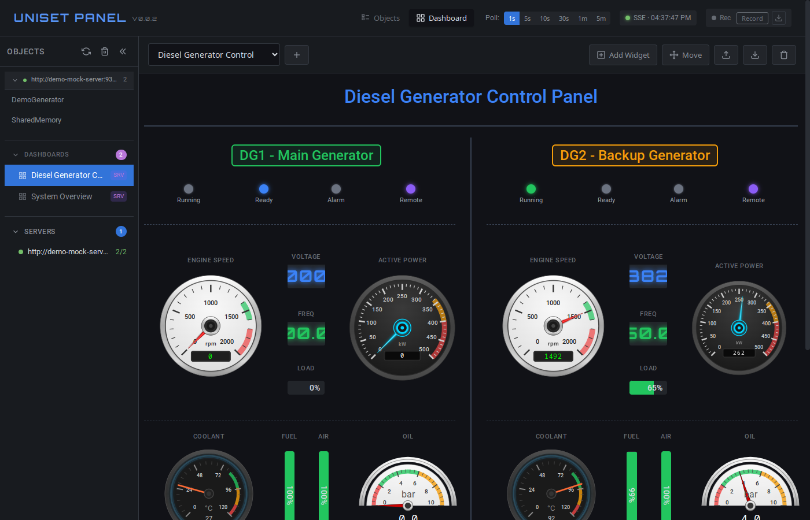

# uniset-panel

Веб-сервер для мониторинга состояния uniset процессов, отслеживания изменений внутренних переменных во времени с отображением графиков.

Часть экосистемы [UniSet2](https://github.com/Etersoft/uniset2) — библиотеки для построения АСУ ТП.

⚠️ Проект пишется в качестве получения опыта создания ПО с помощью ИИ. Т.е. "just for fun"

## Возможности

- **Мульти-сервер** — подключение к нескольким UniSet2 серверам одновременно
- Просмотр внутренних переменных объекта в реальном времени
- Графики для аналоговых и дискретных величин (Chart.js)
- **Dashboards** — настраиваемые панели мониторинга с виджетами (Gauge, Level, LED, Digital, Chart и др.)
- **Journals** — интеграция с ClickHouse для просмотра журналов сообщений
- Хранение истории: in-memory или SQLite
- Единый исполняемый файл (веб-ресурсы встроены через go:embed)
- Расширяемая система рендереров — разный интерфейс для разных типов объектов (IONC, Modbus, OPCUA, UWebSocketGate)
- Collapsible секции (графики, IO, переменные, статистика и др.)
- Сохранение настроек UI в localStorage
- **LogServer клиент** — просмотр логов процесса в реальном времени
- **SSE (Server-Sent Events)** — получение обновлений данных без polling
- **Recording** — запись истории изменений в SQLite с возможностью экспорта
- **Control mode** — режим управления с токенами доступа

## Скриншоты

### Dashboard с виджетами


### Мониторинг с графиками


### Таблица сенсоров


### Modbus регистры


### LogServer


### Режимы управления
| Control mode | Read-only mode |
|:---:|:---:|
|  |  |

**Документация:**
- [Dashboards](docs/dashboards.md) — настройка виджетов и панелей
- [Journals](docs/journal.md) — подключение ClickHouse журналов
- [Control mode](docs/control.md) — режим управления
- [Recording](docs/recording.md) — запись истории

## Установка

```bash
go build -o uniset-panel ./cmd/server
```

## Запуск

```bash
./uniset-panel [опции]
```

### Параметры

| Параметр | По умолчанию | Описание |
|----------|--------------|----------|
| `--uniset-url` | - | Адрес UniSet2 HTTP API (можно указать несколько раз) |
| `--config` | - | YAML файл конфигурации серверов |
| `--addr` | `:8181` | Адрес веб-сервера |
| `--poll-interval` | `1s` | Интервал опроса uniset |
| `--storage` | `memory` | Тип хранилища: `memory` или `sqlite` |
| `--sqlite-path` | `./history.db` | Путь к SQLite базе данных |
| `--history-ttl` | `1h` | Время хранения истории |
| `--log-format` | `text` | Формат логов: `text` или `json` |
| `--log-level` | `warn` | Уровень логирования: `debug`, `info`, `warn`, `error` |
| `--uniset-config` | - | Путь к XML конфигурации uniset (для имён датчиков) |
| `--uniset-supplier` | `TestProc` | Имя supplier для set/freeze/unfreeze операций |
| `--sensor-batch-size` | `300` | Макс. датчиков в одном запросе к UniSet2 |
| `--dashboards-dir` | - | Директория с серверными дашбордами |
| `--journal-url` | - | ClickHouse URL для журналов (можно несколько раз) |
| `--sm-url` | - | SharedMemory HTTP API URL |
| `--control-token` | - | Токен доступа для режима управления (можно несколько) |
| `--control-timeout` | `60s` | Таймаут сессии управления |
| `--recording-path` | `./recording.db` | Путь к файлу записи |
| `--recording-enabled` | `false` | Запись включена по умолчанию |
| `--max-records` | `1000000` | Максимальное количество записей (циклический буфер) |

### Примеры

```bash
# Базовый запуск
./uniset-panel --uniset-url http://192.168.1.100:8080

# Несколько серверов
./uniset-panel --uniset-url http://server1:8080 --uniset-url http://server2:8080

# С конфигурацией из YAML файла
./uniset-panel --config config.yaml

# С серверными дашбордами
./uniset-panel --uniset-url http://localhost:8080 --dashboards-dir ./dashboards

# С журналами ClickHouse
./uniset-panel --uniset-url http://localhost:8080 --journal-url "clickhouse://localhost:9000/logs"

# С режимом управления
./uniset-panel --uniset-url http://localhost:8080 --control-token secret123
```

Пример YAML конфигурации: [config/config.example.yaml](config/config.example.yaml)

## Архитектура

```
┌─────────────────────────────────────────────────────────────┐
│                      Browser (HTML/JS)                      │
│  ┌──────────────┐  ┌──────────────────────────────────────┐ │
│  │ Список       │  │ Вкладка объекта                      │ │
│  │ объектов     │  │ - таблица переменных                 │ │
│  │              │  │ - графики Chart.js                   │ │
│  └──────────────┘  └──────────────────────────────────────┘ │
└─────────────────────────────────────────────────────────────┘
                              │
                              ▼
┌─────────────────────────────────────────────────────────────┐
│                 uniset-panel (Go Server)               │
│  ┌─────────────┐  ┌─────────────┐  ┌─────────────────────┐  │
│  │ HTTP Server │  │ UniSet      │  │ Storage             │  │
│  │ (REST API)  │  │ Client      │  │ (memory/sqlite)     │  │
│  └─────────────┘  └─────────────┘  └─────────────────────┘  │
└─────────────────────────────────────────────────────────────┘
                              │
                              ▼
┌─────────────────────────────────────────────────────────────┐
│                  uniset процессы (HTTP API)                │
│   /api/v2/list          - список объектов                   │
│   /api/v2/{Object}      - данные объекта                    │
│   /api/v2/{Object}/help - доступные команды                 │
└─────────────────────────────────────────────────────────────┘
```

Документация UniSet2 HTTP API: https://etersoft.github.io/uniset2/

## Структура проекта

```
uniset-panel/
├── cmd/server/main.go       # точка входа
├── internal/
│   ├── config/              # конфигурация (CLI + YAML)
│   ├── uniset/              # HTTP клиент к uniset
│   ├── server/              # менеджер мульти-серверных подключений
│   ├── storage/             # хранилище истории
│   ├── poller/              # периодический опрос
│   ├── api/                 # REST API сервера + SSE
│   ├── logger/              # structured logging (slog)
│   ├── logserver/           # TCP клиент к LogServer uniset
│   ├── sensorconfig/        # парсер XML конфигурации датчиков
│   ├── recording/           # система записи истории в SQLite
│   ├── dashboard/           # серверные дашборды
│   ├── journal/             # ClickHouse журналы
│   ├── ionc/                # IONC poller
│   ├── modbus/              # Modbus poller
│   ├── opcua/               # OPCUA poller
│   ├── uwsgate/             # UWebSocketGate poller
│   └── sm/                  # SharedMemory интеграция
├── ui/
│   ├── embed.go             # go:embed + go:generate директивы
│   ├── concat.go            # скрипт сборки app.js
│   ├── static/
│   │   ├── js/
│   │   │   ├── app.js       # генерируется автоматически
│   │   │   └── src/         # исходные модули (00-*.js ... 99-*.js)
│   │   └── css/
│   └── templates/           # HTML шаблоны
├── config/                  # примеры конфигурации
├── examples/dashboards/     # примеры дашбордов
├── docs/                    # документация
├── tests/                   # Playwright e2e тесты
├── go.mod
└── README.md
```

## LogServer

Для объектов с включённым LogServer (указан host и port в ответе API) доступен просмотр логов в реальном времени:

- Подключение через кнопку "Подключить" в секции "Логи"
- Выбор уровня логов (По умолчанию, CRIT, WARN+, INFO+, DEBUG+, ALL)
- Фильтрация по regexp
- Изменяемый размер окна (перетаскивание за нижнюю границу)
- Сворачивание секции

**Важно:** При выборе "По умолчанию" используются уровни логов, установленные в процессе. Для получения логов может потребоваться выбрать конкретный уровень.

## Recording

Система записи истории позволяет сохранять все изменения переменных в SQLite базу данных для последующего анализа и экспорта.

Подробная документация: **[docs/recording.md](docs/recording.md)**

## Разработка

### Сборка JavaScript

Frontend код (`ui/static/js/app.js`) генерируется автоматически из модулей в `ui/static/js/src/`.

```bash
# Пересобрать app.js из модулей
make app

# Полная сборка (app.js + бинарник)
make build

# Или через go generate
go generate ./ui
```

### Структура модулей

Файлы нумеруются для контроля порядка конкатенации:

| Диапазон | Категория | Содержимое |
|----------|-----------|------------|
| 00-09 | Core | state, SSE, control, recording |
| 10-19 | Renderers base | BaseObjectRenderer, mixins, simple renderers |
| 20-29 | Specific renderers | IONC, OPCUA, Modbus, UWSGate |
| 30-39 | Components | LogViewer |
| 40-49 | UI | Charts, dialogs |
| 50-59 | UI | Tabs, render functions, sections, settings |
| 60-69 | Dashboard | Widgets, manager, dialogs |
| 99 | Init | DOMContentLoaded |

### Добавление нового модуля

1. Создать файл `ui/static/js/src/XX-name.js` с подходящим номером
2. Запустить `make app` для регенерации app.js
3. Проверить сборку: `make build`

**Важно:** Не редактировать `ui/static/js/app.js` напрямую — он перезаписывается при сборке.

## Лицензия

MIT
