# Dashboards

Dashboards - система визуализации данных в реальном времени с гибким расположением виджетов на сетке.

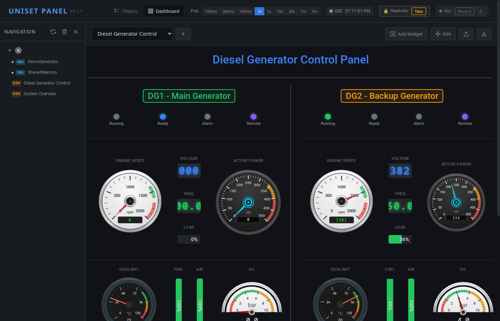

## Содержание

- [Начало работы](#начало-работы)
- [Импорт и экспорт](#импорт-и-экспорт)
- [Сетка и позиционирование](#сетка-и-позиционирование)
- [Режим редактирования](#режим-редактирования)
- [Виджеты — пассивные (read-only)](#виджеты--пассивные-read-only)
  - [Gauge](#gauge)
  - [Level](#level)
  - [Digital](#digital)
  - [LED](#led)
  - [Label](#label)
  - [Divider](#divider)
  - [StatusBar](#statusbar)
  - [BarGraph](#bargraph)
  - [Chart](#chart)
- [Виджеты — активные (write-capable)](#виджеты--активные-write-capable)
  - [Общие принципы](#общие-принципы-active)
  - [Toggle](#toggle)
  - [PushButton](#pushbutton)
  - [Setpoint](#setpoint)
  - [Generator](#generator)
- [Цветовые зоны](#цветовые-зоны)
- [Примеры](#примеры)

---

## Начало работы

### Переключение на Dashboard

1. Нажмите кнопку **Dashboard** в заголовке страницы
2. Выберите дашборд из списка слева или из выпадающего меню

### Создание нового дашборда

1. Нажмите кнопку **"+"** рядом с выпадающим списком дашбордов
2. Введите название и описание
3. Настройте сетку (количество колонок, высота строки, отступы)
4. Нажмите **Create**

---

## Импорт и экспорт

### Экспорт дашборда

1. Выберите дашборд из списка
2. Нажмите кнопку **Export** в тулбаре
3. Файл `dashboard-name.json` будет скачан в папку загрузок

Экспортированный файл содержит полную конфигурацию дашборда и может быть:
- Сохранён как резервная копия
- Передан другим пользователям
- Отредактирован вручную в текстовом редакторе
- Размещён на сервере в директории, указанной через `--dashboards-dir` (например, `config/dashboards/`)

### Импорт дашборда

1. Нажмите кнопку **Import** в тулбаре
2. Выберите JSON файл с дашбордом
3. Дашборд появится в списке

**Особенности импорта:**
- Если дашборд с таким именем уже существует, он будет перезаписан
- Импортированные дашборды сохраняются в localStorage браузера
- Для общего доступа разместите файл в директории, указанной через `--dashboards-dir` на сервере (например, `config/dashboards/`)

### Серверные дашборды

Дашборды можно размещать на сервере в директории, указанной через `--dashboards-dir` (например, `config/dashboards/`).

**Важно:** серверные дашборды загружаются только если при запуске указан `--dashboards-dir`. Без этого флага список будет пустым.

**Преимущества серверных дашбордов:**
- Доступны всем пользователям
- Не зависят от localStorage браузера
- Помечены как "server" в списке
- Не могут быть удалены через UI (только редактирование файла)

---

## Сетка и позиционирование

Дашборд использует CSS Grid для размещения виджетов.

### Параметры сетки

- **Columns (cols)**: Количество колонок. По умолчанию 48 - позволяет гибко делить на 2, 3, 4, 6, 8, 12, 16, 24 части.
- **Row Height**: Высота одной строки в пикселях (по умолчанию 30px)
- **Gap**: Отступ между виджетами (по умолчанию 4px)

### Позиционирование виджета

Позиция и размер виджета задаются через drag-and-drop в режиме редактирования. Точная подстройка позиции доступна через CSS-поля offset в JSON конфигурации.

### Пример расчёта размера

При `rowHeight: 30` и `gap: 4`:
- Виджет с `height: 9` = 9 × 30 + 8 × 4 = 302px
- Виджет с `width: 10` при 48 колонках = ~20% ширины

---

## Режим редактирования

### Включение режима

Нажмите кнопку **Edit** в тулбаре дашборда.

### Возможности в режиме редактирования

На каждом виджете появляются кнопки:
- **⚙** (Config) - открыть настройки виджета
- **🗑** (Delete) - удалить виджет
- Drag - перемещение виджета мышью

### Добавление виджета

1. Нажмите **Add Widget** в тулбаре
2. Выберите тип виджета из списка
3. Настройте параметры в диалоге
4. Нажмите **Apply**

### Перемещение виджетов

1. Включите режим **Edit**
2. Перетащите виджет за область заголовка
3. Отпустите в новой позиции

### Поворот виджета

В настройках виджета (⚙) доступно поле Rotate (0-360°) с пресетами 0°, 90°, 180°, 270°. Поворот применяется как CSS transform.

---

## Виджеты — пассивные (read-only)

Эти виджеты только **отображают** значения от датчиков. Не требуют captured controlToken и не записывают ничего в систему.

### Gauge

Стрелочный индикатор для отображения аналоговых значений.

| Стиль | Описание | Скриншот |
|-------|----------|----------|
| `default` | 180° дуга с иглой | — |
| `speedometer` | Белый спидометр с дугой | 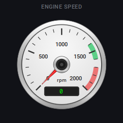 |
| `dual` | Двухшкальный (основное + целевое значение) | 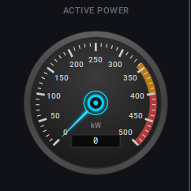 |
| `arc270` | Чёрный с дугой 270° | 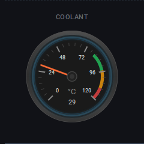 |
| `semicircle` | Классический полукруглый | 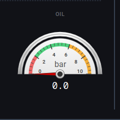 |

**Диалог настроек:**

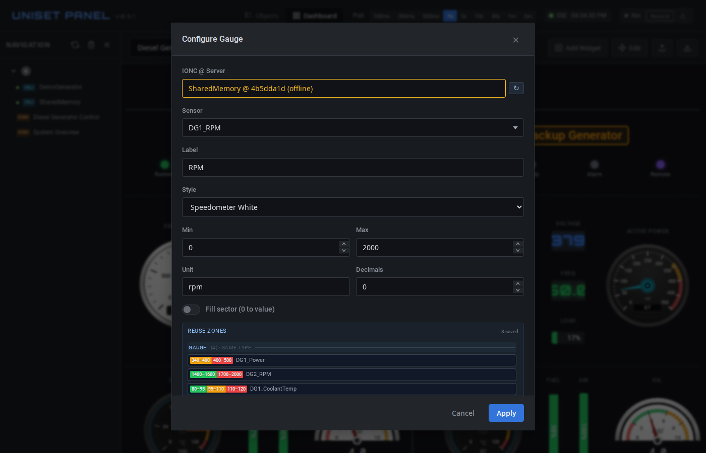

**Настройки:**

| Параметр | Описание |
|----------|----------|
| `sensor` | Имя датчика |
| `sensor2` | Второй датчик (только для dual style) |
| `label` | Подпись |
| `style` | Стиль отображения |
| `min` / `max` | Диапазон шкалы |
| `unit` | Единица измерения (°C, %, bar и т.д.) |
| `decimals` | Количество знаков после запятой |
| `zones` | Цветовые зоны (см. [Цветовые зоны](#цветовые-зоны)) |
| `fillSector` | Заливка сектора от 0 до текущего значения (boolean) |

---

### Level

Индикатор уровня (вертикальный или горизонтальный).

| Ориентация | Скриншот |
|------------|----------|
| Vertical | 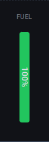 |
| Horizontal | 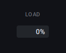 |

**Диалог настроек:**

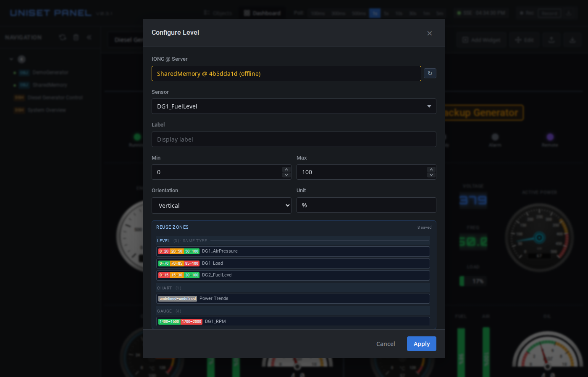

**Настройки:**

| Параметр | Описание |
|----------|----------|
| `sensor` | Имя датчика |
| `label` | Подпись |
| `min` / `max` | Диапазон |
| `unit` | Единица измерения |
| `orientation` | `vertical` или `horizontal` |
| `zones` | Цветовые зоны (см. [Цветовые зоны](#цветовые-зоны)) |

**Пример использования:** индикатор уровня топлива, давления воздуха, нагрузки.

---

### Digital

Цифровой дисплей в стиле семисегментного индикатора.

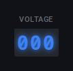

**Диалог настроек:**

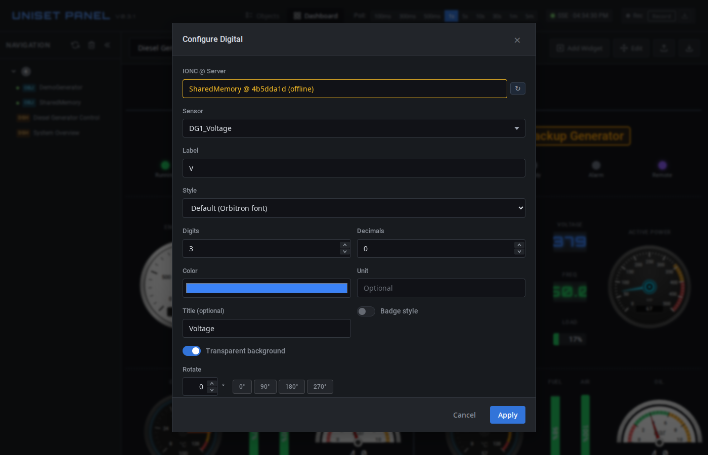

**Настройки:**

| Параметр | Описание |
|----------|----------|
| `sensor` | Имя датчика |
| `label` | Подпись (V, Hz, A и т.д.) |
| `style` | Стиль: `default` (Orbitron), `lcd` (7-сегментный, светло-зелёный фон), `led` (7-сегментный, светящийся) |
| `digits` | Количество цифр (1-12, по умолчанию 6) |
| `decimals` | Знаков после запятой |
| `unit` | Единица измерения |
| `color` | Цвет цифр |

---

### LED

Светодиодный индикатор вкл/выкл.

**Настройки:**

| Параметр | Описание |
|----------|----------|
| `sensor` | Имя датчика |
| `label` | Подпись |
| `threshold` | Порог срабатывания (значение > threshold = ON) |
| `onColor` | Цвет во включённом состоянии |
| `offColor` | Цвет в выключенном состоянии |
| `errorColor` | Цвет при ошибке |
| `blinkOnError` | Мигать при ошибке |

---

### Label

Статическая текстовая метка или заголовок.


**Настройки:**

| Параметр | Описание |
|----------|----------|
| `text` | Текст |
| `fontSize` | Размер: `small`, `medium`, `large`, `xlarge` |
| `color` | Цвет текста |
| `align` | Выравнивание: `left`, `center`, `right` |
| `border` | Показать рамку (nameplate) |
| `borderColor` | Цвет рамки |
| `borderWidth` | Толщина рамки |
| `borderRadius` | Скругление углов |
| `backgroundColor` | Цвет фона |

---

### Divider

Разделительная линия (горизонтальная или вертикальная).

**Диалог настроек:**

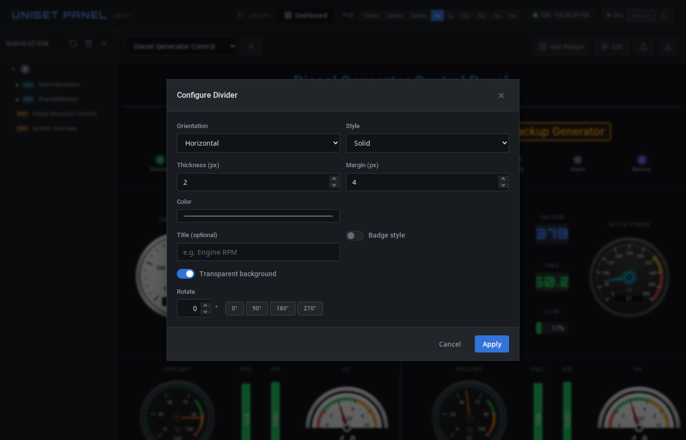

**Настройки:**

| Параметр | Описание |
|----------|----------|
| `orientation` | `horizontal` или `vertical` |
| `color` | Цвет линии |
| `thickness` | Толщина в пикселях |
| `style` | `solid`, `dashed`, `dotted` |
| `margin` | Отступы от краёв |

---

### StatusBar

Панель статусных индикаторов (несколько LED в ряд).

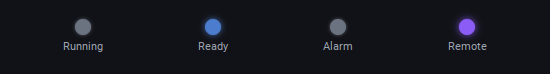

**Диалог настроек:**

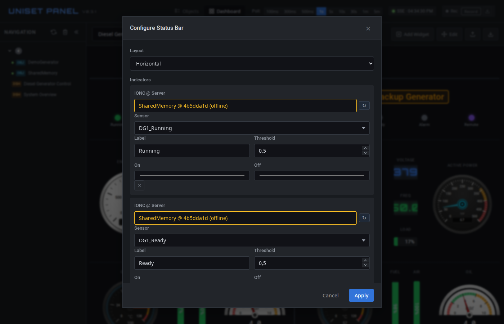

**Настройки:**

| Параметр | Описание |
|----------|----------|
| `layout` | `horizontal` или `vertical` |
| `items` | Массив индикаторов |

Каждый элемент в `items` содержит:
- `label` - подпись индикатора
- `sensor` - имя датчика
- `threshold` - порог срабатывания
- `onColor` / `offColor` - цвета состояний

---

### BarGraph

Столбчатая диаграмма для нескольких значений.

**Настройки:**

| Параметр | Описание |
|----------|----------|
| `orientation` | `vertical` (по умолчанию) или `horizontal` |
| `items` | Массив столбцов |

Каждый элемент в `items` содержит:
- `label` - подпись
- `sensor` - имя датчика
- `min` / `max` - диапазон (per-item, по умолчанию 0-100)
- `color` - цвет столбца
- `unit` - единица измерения
- `decimals` - знаков после запятой

---

### Chart

График временных рядов с поддержкой нескольких датчиков.

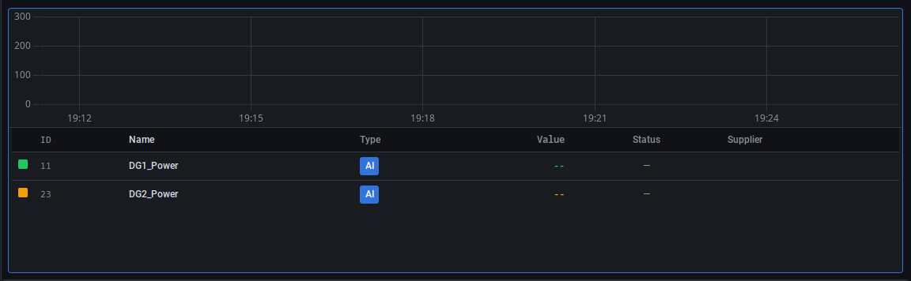

**Диалог настроек:**

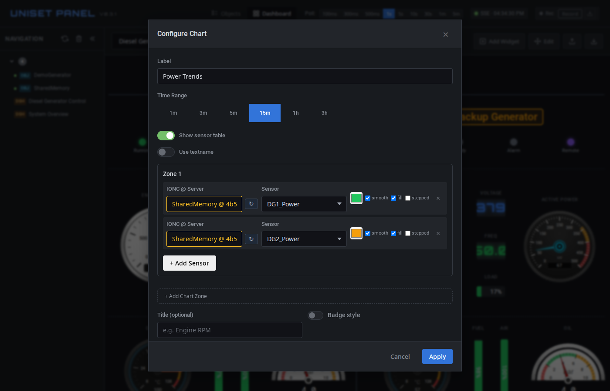

**Настройки:**

| Параметр | Описание |
|----------|----------|
| `label` | Заголовок графика |
| `timeRange` | Временной диапазон: 1m, 5m, 15m (по умолчанию), 1h, 3h |
| `showTable` | Показать таблицу значений |
| `useTextname` | Использовать textname из sensorconfig вместо имени датчика |
| `zones` | Группы датчиков |

Для добавления датчиков на график:
1. Откройте настройки виджета Chart
2. Введите имя датчика в поле автодополнения
3. Выберите цвет линии
4. Включите/выключите заливку под графиком
5. Нажмите Apply

---

## Виджеты — активные (write-capable)

Активные виджеты позволяют **записывать** значения в датчики через POST на endpoint `ionc/set`. Используются для дистанционного управления (запуск/останов оборудования, задание setpoint'ов, тестовые сигналы).

### Общие принципы (active)

**Контроль (controlToken).** Все active widgets требуют, чтобы оператор «взял» контроль через кнопку **Take** в правом верхнем углу. Без активного controlToken виджеты visually disabled (серые, cursor: not-allowed) и клики игнорируются — даже если SSE feedback продолжает приходить.

**Edit mode.** В режиме редактирования дашборда (Edit button) все active widgets также disabled — клик открывает config dialog, не пишет.

**Two-way binding (для Toggle / Setpoint).** Виджет хранит две величины:
- `feedbackValue` — что прочитано от сервера через SSE
- `commandValue` — что пользователь только что отправил (`null` если не редактировал)

Когда они различаются (`commandValue !== null && commandValue !== feedbackValue`) — widget в **`dirty`** состоянии (жёлтая подсветка). Когда feedback догнал command (с tolerance step/2 для float) — dirty снимается автоматически.

**writeState — состояния POST'а.** При записи виджет проходит:
- `idle` (default) — нет активной записи
- `pending` — POST в полёте, виджет с лёгким grayscale
- `success` — кратковременная зелёная подсветка границы
- `error` — пурпурная подсветка границы + tooltip с сообщением

**SCADA color convention.** В UI виджетов:
- **зелёный** (#22c55e) — успех / running / current value
- **жёлтый** (#fbbf24) — dirty / pending command (не подтверждено сервером)
- **пурпурный** (#a855f7) — write-error (POST не прошёл, операционная проблема)
- **красный** (#ef4444) — НЕ используется в active widgets (зарезервирован за процессными авариями: alarms, faults, emergency)

**requireConfirmation.** Опция в config form — спрашивать `window.confirm` перед каждой записью (для критичных команд: emergency stop, reset). По умолчанию off. Для Generator — спрашивает один раз при Start, не на каждом тике.

**Server dropdown:** первое поле в config dialog любого активного widget'а.
Определяет, на какой UniSet2 сервер пишется значение. Если у тебя один
сервер — он выбран по умолчанию. Если несколько — выбери конкретный.
Смена сервера в dropdown'е перезагружает список IONC объектов и
очищает выбор датчика.

Если у тебя есть существующие dashboard'ы, созданные до введения этого
поля — они автоматически мигрируют на первом open: widget'ы получают
`serverId` = первый connected сервер, dashboard config пересохраняется
в localStorage. Если миграция выбрала не тот сервер — открой config
dialog widget'а и поменяй вручную.

---

### Toggle

Двухсостоятельный переключатель для DI/DO/AI/AO датчиков (любые два числовых значения, не только 0/1).

| Стиль | Описание |
|-------|----------|
| `slider` (default) | Слитая композиция: цвет track = feedback, позиция handle = command, жёлтая граница на divergence. Под track — текстовая state-label (ON/OFF) |
| `checkbox` | Material flat 24×24 + label справа. ✓ при ON, dashed `?` при unknown (значение ≠ valueOn ≠ valueOff). Click anywhere on widget triggers writeValue |

**Clean state** (cmd === fb) — широкие style варианты для разных макетов:

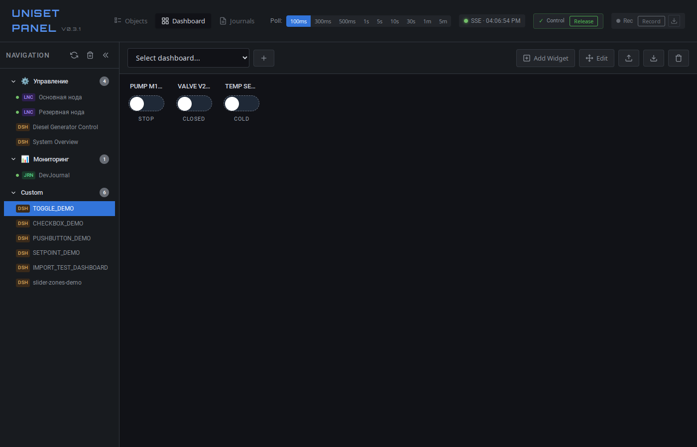

**Diverge / unknown** — жёлтая граница при divergence, `?` при unknown:

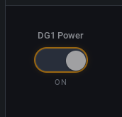

**Настройки:**

| Параметр | Описание |
|----------|----------|
| `objectName` | IONC объект (default `SharedMemory`) |
| `sensor` | Имя датчика (autocomplete из IONC) |
| `sensorId` | Числовой ID (резолвится autocomplete'ом) |
| `style` | `slider` или `checkbox` |
| `valueOff` / `valueOn` | Числовые значения «выключено» / «включено» (default 0 / 1) |
| `labelOff` / `labelOn` | Текстовые подписи для slider style (default `OFF` / `ON`) |
| `label` | Заголовок виджета (default = имя датчика) |
| `requireConfirmation` | Спрашивать confirm перед записью |

**Поведение:** click → POST `valueOn` если текущее `valueOff` (или unknown), иначе POST `valueOff`. Dirty снимается когда SSE feedback совпадёт с командой.

---

### PushButton

Write-only momentary/pulse кнопка для команд (RESET, START, STOP, ACK ALARM). Семантически отличается от Toggle — нет двух-состоянного латча, feedback от sensor'а игнорируется (fire-and-forget).

| Стиль | Назначение |
|-------|------------|
| `flat` (default, 2×1) | Material primary blue. Для group of buttons, частые действия |
| `mushroom` (2×2) | SCADA-classic круглая красная объёмная. Для emergency / mode switches (STOP, EMERGENCY) |
| `pill` (2×1) | Minimal outline pill, заполняется при нажатии. Для частых маловажных действий (ACK ALARM) |

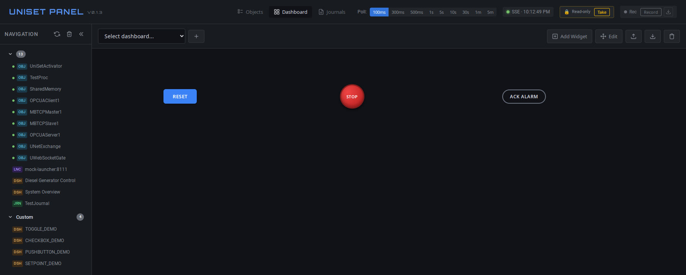

**Настройки:**

| Параметр | Описание |
|----------|----------|
| `objectName` | IONC объект |
| `sensor` / `sensorId` | Целевой датчик |
| `style` | `flat` / `mushroom` / `pill` |
| `mode` | `pulse` (default) — POST valueOn → wait `pulseWidth` ms → POST valueOff. `momentary` — mousedown → POST valueOn, mouseup → POST valueOff |
| `valueOn` / `valueOff` | Числа «нажато» / «отпущено» (default 1 / 0) |
| `pulseWidth` | Длительность импульса в ms для pulse mode (default 500) |
| `label` | Подпись на кнопке |
| `requireConfirmation` | В `momentary` НЕ работает (warning в форме) |

**Поведение:**
- `pulse` mode: click → POST valueOn → визуальная вспышка (yellow flash 300ms) → wait pulseWidth → POST valueOff. Второй POST через `_writeValueRaw` (без confirm dialog).
- `momentary` mode: window-level mouseup гарантирует release даже если курсор ушёл с кнопки.

---

### Setpoint

Числовой задатчик для AI/AO датчиков. Произвольное значение в `[min, max]` с шагом `step`.

| Стиль | Описание |
|-------|----------|
| `input` (default, 3×2) | Текстовый input + Apply кнопка (visible в dirty). Enter = apply, Esc = cancel |
| `slider` (6×4 horizontal / 4×6 vertical) | Custom-rendered (БЕЗ нативного `<input type=range>`) с mouse-friendly UX для SCADA. Click on track = handle прыгает + один POST. Drag = один POST на release. Color zones, vertical orientation, fb-marker — см. ниже |
| `stepper` (3×2) | Кнопки `−` / `+` + value-label. Auto-apply on click. × Cancel кнопка в dirty state |

**Clean state:**

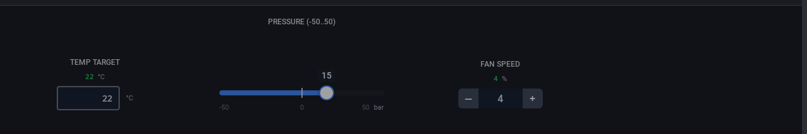

**Dirty state** (cmd ≠ fb — жёлтая граница input / жёлтый текст для slider/stepper, видна Apply / Cancel кнопка):

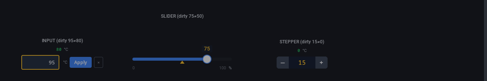

**Настройки:**

| Параметр | Описание |
|----------|----------|
| `objectName` | IONC объект |
| `sensor` / `sensorId` | Целевой датчик |
| `style` | `input` / `slider` / `stepper` |
| `min` / `max` | Границы диапазона |
| `step` | Шаг изменения (для slider/stepper). При `step ≤ 0` → 1. При `min > max` пара свапается |
| `unit` | Текстовая подпись после значения (`°C`, `%`, `bar`). В стиле `slider` рендерится рядом с max-меткой |
| `applyMode` | `manual` (default) — explicit Apply кнопка / Enter. `auto` — debounce 500ms на change → автоотправка. Stepper всегда auto-apply on click. **Для `slider` игнорируется** (всегда write-on-release/click) и поле скрывается в config-форме |
| `orientation` | Только для `slider`: `horizontal` (default) или `vertical`. В vertical top = max, bottom = min |
| `zones` | Только для `slider`: `[{from, to, color}]` — цветные зоны на треке (формат как у Gauge/Level). Если задано — заменяет однотонный fill |
| `fillOrigin` | Только для `slider`: откуда рисуется заливка. `zero` (default) — от нуля (signed: вправо для положительных значений, влево для отрицательных; если ноль вне диапазона, ведёт себя как `min`). `min` — от левого/нижнего края до значения (legacy). `max` — от значения до правого/верхнего края (зеркало `min`) |
| `label` | Заголовок виджета |
| `requireConfirmation` | Confirm перед записью |

**Поведение:**
- Input style: type=text + inputmode=decimal (нет spin buttons, нет save-password popup); keydown filter блокирует буквы; click на input выделяет текущее значение (replace-on-type).
- Inline-edit (slider/stepper): double-click на value → input на месте → Enter apply / Esc cancel / blur apply. Inline-edit Enter всегда apply независимо от applyMode.
- Validation: значения вне `[min, max]` обрезаются (clamp).
- Auto-snap dirty: при SSE feedback совпавшем с command (с tolerance step/2 для float) → dirty снимается. Не срабатывает во время typing — только на feedback от сервера.
- Esc через widget container — отменяет pending command для любого стиля.

**Slider-специфика (`style: 'slider'`):**

UX-семантика для оператора SCADA:
- **Click anywhere on track** — handle прыгает в точку клика, отправляется один POST.
- **Drag** (mousedown → mousemove → mouseup) — handle двигается за курсором, POST отправляется только на release. Промежуточные mousemove не пишут в датчик.
- **Inline-edit** — двойной клик по числу открывает input для точного ввода. Enter применяет, Esc отменяет.

Two-mode feedback tracking:
- **Idle** (`commandValue === null`, оператор не активен): handle следует за `feedbackValue` по приходу SSE — слайдер отображает реальное состояние датчика, даже если он дрейфует без вмешательства.
- **Dirty** (после клика/драга, до auto-snap): handle стоит на `commandValue` (что задал оператор), а отдельный янтарный маркер `▾` под треком показывает текущий `feedbackValue` — оператор видит расхождение «команда vs реальность».
- **Auto-snap dirty → idle** при `|cmd - fb| < step/2` (например, регулятор отработал уставку).

Защита от прыжков во время drag: пока пользователь тянет handle, входящие SSE-обновления НЕ перерисовывают handle — он остаётся под курсором. Изменения feedback применяются на mouseup.

**Value bubble следует за handle.** Текущее значение рендерится не в углу виджета, а маленьким бабблом непосредственно над ползунком (для horizontal) или слева от ползунка (для vertical) — так оператору сразу видно к какой точке шкалы относится цифра. Bubble и handle двигаются синхронно. В dirty-состоянии (cmd ≠ fb) текст бабла янтарный — чтобы выделять незакоммиченную команду.

**Zero mark на шкале.** Если диапазон проходит через ноль (`min < 0 < max`, например `-50..+50`), на треке рисуется тонкий вертикальный (или горизонтальный — для vertical) штрих, а в подписях min/max добавляется метка `0` на правильной позиции. Так оператор сразу видит знак значения и точку перехода. Когда ноль совпадает с одной из границ — отдельная метка не рендерится (она уже есть в min или max).

**Fill origin** (`fillOrigin`). По умолчанию `zero` — заливка стартует от нуля (signed: вправо для положительных значений, влево — для отрицательных). Это позволяет оператору с одного взгляда отличить, в какую сторону отклонилось значение, особенно для двухполярных шкал (давление/расход, температура с отрицательным диапазоном, отклонение от уставки). Если ноль вне диапазона (`min ≥ 0` или `max ≤ 0`), `zero` автоматически ведёт себя как `min`. Альтернативы — `min` (legacy: от левого/нижнего края до значения) и `max` (зеркало `min`: от значения до правого/верхнего края).

Initial state: до первого SSE update виджет рендерится с классом `setpoint-slider-no-data` — handle и fill полупрозрачные, value показывает `--`. Как только приходит первое значение, виджет «оживает».

Color zones: `zones: [{from, to, color}]` — массив цветных полос на треке (формат идентичен Gauge / Level widgets). Например, для контроля температуры:
```json
[
  { "from": 0,  "to": 40,  "color": "#10b981" },
  { "from": 40, "to": 75,  "color": "#fbbf24" },
  { "from": 75, "to": 100, "color": "#ef4444" }
]
```

Vertical orientation: top = max, bottom = min. Drag сверху вниз уменьшает значение. Метки `min`/`max` справа от трека (max сверху, min снизу). Ширина виджета по умолчанию увеличена под labels (4 колонки против 6 в horizontal — потому что vertical проще «положить рядом»).

Конфиг-форма с conditional полями: при выборе `style: 'slider'` поле `applyMode` скрывается, появляются `orientation` и `zones` editors. Переключение обратно — наоборот.

---

### Generator

Записывает в датчик value по математическому закону во времени (square / sin / cos / linear / random) — для тестирования / симуляции. Один стиль `compact` (default 3×1).

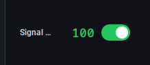

На скриншоте: stopped (серое `--` + серый toggle), running square (PUMP_CMD = 100, зелёный toggle), running sin (SETPT = 847, зелёный toggle).

**Настройки:**

| Параметр | Описание |
|----------|----------|
| `objectName` | IONC объект |
| `sensor` / `sensorId` | Целевой датчик |
| `type` | `square` (default) / `sin` / `cos` / `linear` / `random` |
| `min` / `max` | Диапазон значений |
| `step` | Для linear/sin/cos — число точек на полуцикл |
| `pause` | Для linear/sin/cos/square — ms между шагами |
| `pulseWidth` | Для square — ширина импульса в ms |
| `period` | Для random — ms между генерациями (минимум 100) |
| `label` | Подпись виджета |
| `requireConfirmation` | Спрашивает confirm один раз при Start, не на каждом тике |

**Поведение:**
- Toggle on → создаётся `SignalGenerator`, `start()`, каждый тик POST'ит сгенерированное значение в датчик.
- Toggle off → stop, value → `--`, cache cleared.
- POST error → автостоп + пурпурная граница + tooltip.
- ControlToken released во время работы → автостоп.
- Widget removed (delete) → автостоп (нет утечек таймеров).
- Не persist running state между reload'ами — после перезагрузки страницы всегда stopped.
- Conditional поля в config form по `type` (например, `random` показывает только `period`).

---

## Цветовые зоны

Цветовые зоны позволяют визуально выделять диапазоны значений на виджетах Gauge и Level.

### Создание зон в диалоге настроек

1. Откройте настройки виджета (⚙)
2. Найдите секцию **Zones**
3. Нажмите **Add Zone**
4. Укажите:
   - **From** - начало диапазона
   - **To** - конец диапазона
   - **Color** - цвет зоны (выбор из палитры или HEX-код)
5. Добавьте дополнительные зоны при необходимости
6. Нажмите **Apply**

### Рекомендации по зонам

**Для температуры:**
- Зелёный (норма): 80-95°C
- Жёлтый (предупреждение): 95-110°C
- Красный (опасность): 110-120°C

**Для уровня топлива:**
- Красный (критично): 0-15%
- Жёлтый (низкий): 15-30%
- Зелёный (норма): 30-100%

**Для нагрузки:**
- Зелёный (норма): 0-70%
- Жёлтый (высокая): 70-85%
- Красный (перегрузка): 85-100%

### Стандартные цвета

| Цвет | HEX | Назначение |
|------|-----|------------|
| Зелёный | `#22c55e` | Норма, безопасно |
| Жёлтый | `#f59e0b` | Предупреждение |
| Красный | `#ef4444` | Опасность, ошибка |
| Синий | `#3b82f6` | Информация |
| Фиолетовый | `#8b5cf6` | Специальный статус |
| Серый | `#6b7280` | Неактивно, выключено |

---

## Общие настройки виджетов

Все виджеты поддерживают:

| Параметр | Описание |
|----------|----------|
| `title` | Заголовок виджета |
| `titleBorder` | Показать заголовок как badge |
| `transparent` | Прозрачный фон виджета |

---

## Примеры

### Diesel Generator Dashboard

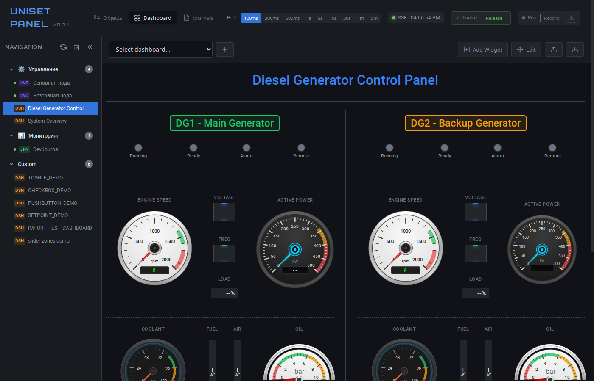

Дашборд для мониторинга двух дизель-генераторов включает:

- **Gauge (speedometer)** - обороты двигателя (RPM)
- **Gauge (dual)** - активная мощность (Power)
- **Gauge (arc270)** - температура охлаждающей жидкости
- **Gauge (semicircle)** - давление масла
- **Level (vertical)** - уровень топлива и давление воздуха
- **Level (horizontal)** - нагрузка (Load)
- **Digital** - напряжение и частота
- **StatusBar** - статус (Running, Ready, Alarm, Remote)
- **Label** - заголовки секций
- **Divider** - разделители
- **Chart** - график мощности

---

## Советы

1. **Используйте сетку 48 колонок** - легко делить на любое количество секций
2. **Группируйте связанные виджеты** - используйте Label и Divider для структуры
3. **Цветовые зоны** - помогают быстро оценить состояние
4. **Offset** - используйте для точной подстройки позиции
5. **Прозрачность** - `transparent: true` для более чистого вида
