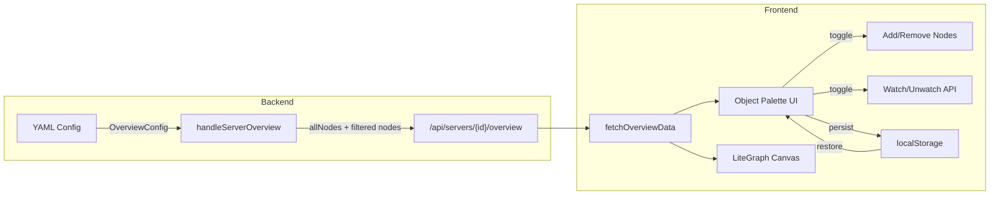

# Overview Object Palette -- Design Document

## Overview

Add an object palette dropdown to the System Overview toolbar that allows users to selectively show/hide process nodes on the graph. Selection is persisted in localStorage, config provides initial defaults via glob patterns, and SSE Watch/Unwatch is managed to avoid unnecessary polling for hidden objects.

## Design Summary (Meta)

```yaml
design_type: "extension"
risk_level: "low"
complexity_level: "medium"
complexity_rationale: >
  (1) ACs require coordinating 3 state sources (config defaults, localStorage, runtime selection)
  with immediate graph mutation, SSE Watch/Unwatch side-effects, and backend config extension.
  (2) Constraints: LiteGraph.js graph/canvas manipulation (add/remove nodes and links at runtime),
  glob pattern matching reuse from sidebar, backwards-compatible API response extension.
main_constraints:
  - "Backward compatible API -- existing clients must not break"
  - "LiteGraph.js Canvas2D -- node add/remove requires graph.add()/graph.remove() + edge recomputation"
  - "Vanilla JS without frameworks -- concat module system"
biggest_risks:
  - "LiteGraph.js graph mutation (remove+re-add nodes) may cause visual glitches or lost link state"
  - "Race condition: user toggles node while SSE update arrives for same node"
unknowns:
  - "Exact visual behavior of LiteGraph.js when dynamically removing nodes at runtime"
```

## Background and Context

### Prerequisite ADRs

- `docs/plans/system-overview-adr.md`: LiteGraph.js selection for System Overview canvas
- No common ADRs exist yet (no `docs/adr/` directory found)

### Agreement Checklist

#### Scope
- [x] Backend: Add `OverviewConfig` to YAML config with `patterns`/`exclude` glob fields
- [x] Backend: Extend `OverviewResponse` with `allNodes` field listing all eligible object names
- [x] Backend: Apply config patterns to filter default `nodes` in response
- [x] Frontend: Toolbar dropdown palette with checkboxes per object
- [x] Frontend: "Add All" / "Remove All" / "Reset" buttons in palette
- [x] Frontend: localStorage persistence of selection per server
- [x] Frontend: SSE Watch/Unwatch when objects added/removed from graph
- [x] Frontend: Immediate graph mutation (add/remove LiteGraph nodes + edges)

#### Non-Scope (Explicitly not changing)
- [x] Existing System Overview layout algorithms (Kahn's, barycenter)
- [x] Existing SSE hub architecture and subscription mechanism
- [x] Sidebar resolver logic (reuse `path.Match` pattern, not `sidebar.MatchEntity`)
- [x] Dashboard system
- [x] Other renderers (Modbus, IONC, OPCUA, etc.)
- [x] Cross-server overview (remains single-server)

#### Constraints
- [x] Backward compatibility: Required -- `OverviewResponse` adds field, does not change existing fields
- [x] Parallel operation: Yes -- palette is additive to existing overview UI
- [x] Performance measurement: Not required -- palette is a simple UI toggle

#### Applicable Standards
- [x] Handler helpers: `writeJSON`, `writeError` `[explicit]` - Source: CLAUDE.md
- [x] SSE event constants: `Event*` in `sse.go` `[explicit]` - Source: CLAUDE.md
- [x] Constants naming: `UPPER_CASE` for immutable JS values `[explicit]` - Source: CLAUDE.md
- [x] Config struct pattern: `*Config` in `yaml.go`, setter in `handlers.go` `[implicit]` - Evidence: `SidebarConfig` pattern in yaml.go, handlers.go, main.go - Confirmed: Yes
- [x] Glob matching: `path.Match` for simple glob patterns `[implicit]` - Evidence: `sidebar/resolver.go` uses `path.Match` - Confirmed: Yes

### Problem to Solve

The System Overview currently displays all eligible process nodes unconditionally. In systems with many processes, the diagram becomes cluttered. Users need the ability to focus on specific processes of interest, and the system administrator needs a way to set sensible defaults via configuration.

### Current Challenges

1. No way to hide irrelevant nodes from the overview graph
2. `handleServerOverview` calls `instance.Watch()` for ALL eligible objects, even if user only cares about a few
3. No config-level control over which objects appear in overview by default

### Requirements

#### Functional Requirements

- FR1: Toolbar palette dropdown to toggle object visibility
- FR2: Bulk actions (Add All, Remove All, Reset)
- FR3: Persist selection in localStorage per server
- FR4: Config-driven defaults (glob patterns)
- FR5: SSE Watch/Unwatch lifecycle management
- FR6: Backend returns full eligible list alongside filtered nodes

#### Non-Functional Requirements

- **Performance**: Palette open/close is instant; node add/remove completes in <100ms for 20 nodes
- **Maintainability**: Reuse existing glob matching pattern; no new dependencies
- **Reliability**: Fallback to show all nodes if no config and no localStorage

## Acceptance Criteria (AC) -- EARS Format

### FR1: Toolbar Palette Dropdown

- [ ] The toolbar shall display an "Objects" button next to existing Fit/Layout buttons
- [ ] **When** user clicks the "Objects" button, the system shall show a dropdown panel listing all eligible objects with checkboxes
- [ ] **When** user clicks the "Objects" button while dropdown is open, the system shall close the dropdown
- [ ] **When** user clicks outside the dropdown, the system shall close the dropdown
- [ ] Each checkbox label shall display the object name; checked = visible on graph

### FR2: Bulk Actions

- [ ] The palette shall include an "Add All" button that checks all objects and adds them to the graph
- [ ] The palette shall include a "Remove All" button that unchecks all objects and removes them from the graph
- [ ] The palette shall include a "Reset" button that restores config-based defaults (or all objects if no config)

### FR3: Object Toggle

- [ ] **When** user checks an unchecked object, the system shall add its node with edges to the graph and call Watch for it
- [ ] **When** user unchecks a checked object, the system shall remove its node and associated edges from the graph
- [ ] **If** the last visible node is unchecked, **then** the graph shall be empty (no error)

### FR4: State Persistence

- [ ] **When** user changes selection, the system shall persist it in localStorage keyed by `overview-palette:${serverId}`
- [ ] **When** overview tab is opened, the system shall restore selection from localStorage if present
- [ ] **If** no localStorage entry exists, **then** the system shall use config defaults
- [ ] **If** no config and no localStorage, **then** all eligible objects shall be shown

### FR5: Config Defaults

- [ ] The backend shall support `overview.patterns` and `overview.exclude` glob fields in YAML config
- [ ] The `patterns` field shall use `path.Match` glob syntax consistent with `SidebarGroupConfig`
- [ ] The `exclude` field shall exclude objects matching any exclude pattern from defaults
- [ ] **If** patterns are empty, **then** all eligible objects are included by default

### FR6: API Extension

- [ ] `GET /api/servers/{id}/overview` response shall include `allNodes` field: array of all eligible `OverviewNode` objects with full port data (sorted by name)
- [ ] The `nodes` field shall contain only objects matching config defaults (or all if no config)
- [ ] The `allNodes` field shall always contain all eligible objects regardless of config
- [ ] Frontend uses `allNodes` to populate palette and to add nodes to graph without additional API calls

### FR7: SSE Watch Management

- [ ] **When** overview tab opens, the backend shall call `Watch()` only for objects in `nodes` (config-filtered visible set)
- [ ] **When** user adds a node via palette, the frontend shall call `GET /api/servers/{id}/overview` with `?selected=name1,name2,...` to trigger Watch for the new set
- [ ] **When** user removes a node, Watch is NOT explicitly revoked (additive-only). The object remains watched until SSE reconnect or tab close/reopen.
- [ ] **When** tab is closed and reopened, Watch is called only for the current selection (from localStorage or config defaults)
- [ ] **When** "Reset" is clicked, Watch state updates on next API call with the reset selection

## Existing Codebase Analysis

### Implementation Path Mapping

| Type | Path | Description |
|------|------|-------------|
| Existing | `internal/config/yaml.go` | Config structs -- add `OverviewConfig` |
| Existing | `internal/config/config.go` | CLI config -- wire `OverviewConfig` from YAML |
| Existing | `internal/api/handlers_overview.go` | Overview handler -- extend response, add filtering |
| Existing | `internal/api/handlers_overview_test.go` | Overview tests -- extend for new fields |
| Existing | `internal/api/handlers.go` | Handlers struct -- add `overviewConfig` field + setter |
| Existing | `cmd/server/main.go` | Wiring -- pass config to handlers |
| Existing | `ui/static/js/src/58-system-overview.js` | Overview frontend -- add palette UI and logic |
| Existing | `ui/static/js/src/00-constants.js` | Constants -- add palette-related constants |
| Existing | `ui/static/css/style.css` | Styles -- add palette dropdown styles |
| New | (none -- all changes to existing files) | |

### Similar Functionality Search

- **Sidebar glob filtering** (`internal/sidebar/resolver.go`): Uses `path.Match` for pattern matching. The overview palette needs simpler matching (just object name against pattern, no entity type prefix). Will reuse `path.Match` directly rather than `sidebar.MatchEntity` (which adds `type:name@server` format not needed here).
- **Dashboard widget visibility**: Dashboard has show/hide per widget, but uses different mechanism (grid layout). No code reuse applicable.
- **Decision**: New implementation for palette, reuse `path.Match` from stdlib for glob matching.

### Code Inspection Evidence

| File/Function | Relevance |
|---------------|-----------|
| `internal/config/yaml.go:ConfigFile` | Integration point -- add `Overview` field |
| `internal/config/config.go:Config.Sidebar` | Pattern reference -- same wiring pattern for `OverviewConfig` |
| `internal/api/handlers_overview.go:handleServerOverview` | Integration point -- modify to return `allNodes` and filter by config |
| `internal/api/handlers_overview.go:isOverviewEligible` | Integration point -- produces the eligible object list |
| `internal/api/handlers.go:Handlers` | Integration point -- add `overviewConfig` field |
| `internal/sidebar/resolver.go:MatchEntity` | Pattern reference -- glob matching approach (but not reused directly) |
| `cmd/server/main.go:350` | Pattern reference -- `cfg.Sidebar` wiring to handlers |
| `ui/static/js/src/58-system-overview.js:initOverviewGraph` | Integration point -- graph build needs palette awareness |
| `ui/static/js/src/58-system-overview.js:buildOverviewGraph` | Integration point -- will be called for filtered node subset |
| `internal/server/manager.go:Watch/Unwatch` | Integration point -- SSE lifecycle management |

## Design

### Change Impact Map

```yaml
Change Target: Overview Object Palette
Direct Impact:
  - internal/config/yaml.go (add OverviewConfig struct, add field to ConfigFile)
  - internal/config/config.go (wire Overview from YAML to Config)
  - internal/api/handlers.go (add overviewConfig field, SetOverviewConfig setter)
  - internal/api/handlers_overview.go (extend response, add allNodes, filter by config)
  - internal/api/handlers_overview_test.go (tests for new behavior)
  - cmd/server/main.go (wire cfg.Overview to handlers)
  - ui/static/js/src/58-system-overview.js (palette UI, state management, graph mutation)
  - ui/static/js/src/00-constants.js (new constants)
  - ui/static/css/style.css (palette dropdown styles)
Indirect Impact:
  - internal/api/server.go (no change -- route already registered)
  - SSE Watch state (objects hidden via palette are not watched)
No Ripple Effect:
  - Existing renderers (Modbus, IONC, OPCUA, etc.)
  - Dashboard system
  - Sidebar resolver
  - Journal, Launcher subsystems
  - Other API endpoints
```

### Architecture Overview



### Data Flow

```
1. User opens System Overview tab
2. Frontend: fetchOverviewData() -> GET /api/servers/{id}/overview
3. Backend:
   a. Collect all eligible objects -> allNodes list
   b. If OverviewConfig set: filter by patterns/exclude -> nodes (default visible)
   c. If no config: nodes = all eligible
   d. Watch only objects in nodes list
   e. Return { serverName, nodes, edges, allNodes }
4. Frontend:
   a. Check localStorage for saved selection
   b. If localStorage exists: use it (override config defaults)
   c. If not: use nodes from response as initial selection
   d. Build graph with selected nodes only
   e. Render palette with allNodes, checked = selected
5. User toggles object:
   a. Update selection state
   b. Add/remove LiteGraph node + recompute edges (using allNodes data for port info)
   c. If adding: re-fetch overview with ?selected=... to trigger Watch for new object
   d. If removing: no Unwatch call (Watch is additive-only; cleared on tab close/SSE reconnect)
   e. Save to localStorage
```

### Integration Points List

| Integration Point | Location | Old Implementation | New Implementation | Switching Method |
|-------------------|----------|-------------------|-------------------|------------------|
| Config loading | `yaml.go` + `config.go` | No `OverviewConfig` | Add `OverviewConfig` struct and wiring | Field addition |
| Handler config | `handlers.go` | No overview config | `overviewConfig` field + `SetOverviewConfig()` | Setter pattern |
| API response | `handlers_overview.go` | Returns `{serverName, nodes, edges}` | Returns `{serverName, nodes, edges, allNodes}` | Field addition (backward compatible) |
| Node filtering | `handleServerOverview` | Watch all, return all eligible | Watch only default-visible, return filtered + allNodes | Conditional logic |
| Config wiring | `main.go` | No overview config | `handlers.SetOverviewConfig(cfg.Overview)` | One-line addition |
| Graph building | `58-system-overview.js` | Build from all nodes in response | Build from selected subset; palette manages selection | Function decomposition |

### Integration Point Map

```yaml
Integration Point 1:
  Existing Component: internal/config/yaml.go:ConfigFile
  Integration Method: Add Overview field to struct
  Impact Level: Low (Field addition, no existing field change)
  Required Test Coverage: YAML parsing test with overview config

Integration Point 2:
  Existing Component: internal/api/handlers_overview.go:handleServerOverview
  Integration Method: Extend response building logic
  Impact Level: Medium (Response format extension, Watch filtering)
  Required Test Coverage: Unit tests for filtered/unfiltered response, allNodes field

Integration Point 3:
  Existing Component: ui/static/js/src/58-system-overview.js:initOverviewGraph
  Integration Method: Add palette initialization after graph build
  Impact Level: Medium (New UI element, state management)
  Required Test Coverage: E2E test for palette visibility and toggle behavior

Integration Point 4:
  Existing Component: cmd/server/main.go
  Integration Method: Add SetOverviewConfig call
  Impact Level: Low (One-line addition)
  Required Test Coverage: None (covered by integration tests)
```

### Main Components

#### Component 1: OverviewConfig (Backend)

- **Responsibility**: Define which objects appear on overview by default
- **Interface**:
  ```go
  type OverviewConfig struct {
      Patterns []string `yaml:"patterns,omitempty"` // glob include patterns
      Exclude  []string `yaml:"exclude,omitempty"`  // glob exclude patterns
  }
  ```
- **Dependencies**: `path.Match` from stdlib

#### Component 2: Extended OverviewResponse (Backend)

- **Responsibility**: Return all eligible objects with full data, plus filtered visible set
- **Interface**:
  ```go
  type OverviewResponse struct {
      ServerName string         `json:"serverName"`
      Nodes      []OverviewNode `json:"nodes"`       // config-filtered visible nodes
      Edges      []OverviewEdge `json:"edges"`       // edges between visible nodes
      AllNodes   []OverviewNode `json:"allNodes"`    // NEW: ALL eligible nodes with full port data
  }
  ```
- **Dependencies**: `isOverviewEligible`, `OverviewConfig`
- **Note**: `allNodes` contains full `OverviewNode` objects (not just names) so that the frontend can add any node to the graph without additional API calls. The frontend extracts names from `allNodes` for the palette list.

#### Component 3: Palette UI (Frontend)

- **Responsibility**: Dropdown panel with checkboxes for object visibility control
- **Interface**: DOM elements within overview toolbar; state in closure/overviewInstances
- **Dependencies**: `overviewInstances[serverId]`, localStorage, `buildOverviewGraph`, `computeOverviewEdges`

### Data Representation Decision

| Criterion | Assessment | Reason |
|-----------|-----------|--------|
| Semantic Fit | Yes | `OverviewConfig` reuses the individual field types (glob pattern slices) from `SidebarGroupConfig.Patterns` and `SidebarConfig.Exclude`, but as a flat structure without groups since overview has no grouping concept |
| Responsibility Fit | Yes | Overview config belongs to overview feature boundary |
| Lifecycle Fit | Yes | Same lifecycle as SidebarConfig -- global, read-only at runtime, loaded once from YAML |
| Boundary/Interop Cost | Low | Simple struct, read-only at runtime |

**Decision**: New structure `OverviewConfig` -- a flattened subset of `SidebarConfig`/`SidebarGroupConfig` fields (patterns + exclude). Separate concern with different context (object names only, no entity type prefix).

### Contract Definitions

#### Backend: Config (Go)

```go
// OverviewConfig describes initial defaults for System Overview.
type OverviewConfig struct {
    Patterns []string `yaml:"patterns,omitempty"` // glob include patterns (e.g. "*Proc")
    Exclude  []string `yaml:"exclude,omitempty"`  // glob exclude patterns (e.g. "Monitor*")
}
```

YAML example (top-level key in config file):

```yaml
overview:
  patterns:
    - "*Proc"
  exclude:
    - "Monitor*"
```

#### Backend: API Response (JSON)

```json
{
  "serverName": "Test Server",
  "nodes": [ /* OverviewNode objects -- filtered by config or all */ ],
  "edges": [ /* OverviewEdge objects -- computed from visible nodes */ ],
  "allNodes": [ /* ALL eligible OverviewNode objects with full port data */ ]
}
```

#### Frontend: localStorage key

```
Key: "overview-palette:${tabKey}"
Value: JSON array of selected object names, e.g. ["AirProc", "TempProc"]
```

### Data Contract

#### handleServerOverview (Extended)

```yaml
Input:
  Type: HTTP GET /api/servers/{id}/overview[?selected=name1,name2,...]
  Preconditions: serverMgr initialized, valid server ID
  Validation: Existing validation (serverMgr nil check, server exists check)
  Query Parameters:
    - selected (optional): comma-separated list of object names to Watch and return as nodes
    - If selected is provided: nodes = only those objects, Watch called for them
    - If selected is absent: nodes = config-filtered defaults (or all if no config)

Output:
  Type: OverviewResponse (JSON)
  Guarantees:
    - allNodes always present, sorted by name, contains ALL eligible OverviewNode objects with full port data
    - nodes contains subset of eligible objects (filtered by ?selected, config, or all)
    - edges computed from nodes (not allNodes)
    - Watch called only for objects in nodes
  On Error: JSON error response with appropriate HTTP status

Invariants:
  - Every node in nodes also appears in allNodes (by name)
  - allNodes is independent of OverviewConfig and ?selected
```

#### matchOverviewPattern (New helper)

```yaml
Input:
  Type: (patterns []string, exclude []string, objectName string) -> bool
  Preconditions: objectName is non-empty
  Validation: Invalid glob patterns logged and skipped

Output:
  Type: bool (true = object is in default selection)
  Guarantees:
    - Empty patterns = include all
    - Non-empty patterns: object must match at least one pattern
    - Exclude always takes precedence over include
  On Error: Invalid pattern skipped with log warning
```

### Field Propagation Map

| Field | Boundary | Status | Detail |
|-------|----------|--------|--------|
| `allNodes` | Backend -> Frontend | preserved | Array of full OverviewNode objects, no transformation |
| `nodes` | Backend -> Frontend | preserved | Same as before, but may be filtered by config |
| `selectedObjects` | Frontend localStorage -> Palette UI | preserved | JSON array round-trips |
| `OverviewConfig.Patterns` | YAML -> ConfigFile -> Config -> Handlers | preserved | Passed through without transformation |

### Interface Change Impact Analysis

| Existing Operation | New Operation | Conversion Required | Adapter Required | Compatibility Method |
|-------------------|---------------|-------------------|------------------|---------------------|
| `OverviewResponse{serverName, nodes, edges}` | `OverviewResponse{serverName, nodes, edges, allNodes}` | None | Not Required | Additive field (backward compatible) |
| `handleServerOverview` (Watch all) | `handleServerOverview` (Watch config-filtered) | Yes | Not Required | Config nil check: nil config = watch all (existing behavior) |
| `buildOverviewGraph(graph, data)` | `buildOverviewGraph(graph, data)` with filtered data | None | Not Required | Frontend filters `data.nodes` before calling |

### Integration Boundary Contracts

```yaml
Backend API -> Frontend:
  Input: GET /api/servers/{id}/overview
  Output: JSON OverviewResponse (sync, HTTP 200)
  On Error: JSON {"error": "message"} with HTTP 4xx/5xx

Frontend Palette -> LiteGraph Graph:
  Input: Toggle object name (add/remove)
  Output: Graph mutation (sync, immediate canvas redraw)
  On Error: Log warning, no user-visible error (graph may be temporarily inconsistent)

Frontend Palette -> localStorage:
  Input: Array of selected object names
  Output: Persisted string (sync)
  On Error: Silent fail (localStorage full or disabled -- palette works without persistence)

Frontend -> Backend Watch:
  Input: GET /api/servers/{id}/overview (triggers Watch for visible nodes)
  Output: SSE object_data events start flowing for watched objects
  On Error: Objects not watched = no SSE updates (acceptable degradation)
```

### Error Handling

| Error | Handling |
|-------|----------|
| Invalid glob pattern in config | Log warning (`slog.Warn`), skip pattern, continue |
| localStorage unavailable | Palette works without persistence; falls back to config defaults each time |
| LiteGraph node removal fails | Log warning, attempt graph rebuild |
| API returns empty allNodes | Show palette with "No objects available" message |

### Logging and Monitoring

- Backend: `slog.Info` when OverviewConfig is loaded with pattern count
- Backend: `slog.Warn` for invalid glob patterns
- Frontend: `console.log` for palette state changes (objects shown/hidden count)

## Implementation Plan

### Implementation Approach

**Selected Approach**: Vertical Slice -- implement feature end-to-end (config -> API -> UI) for immediate usability.

**Selection Reason**: The feature is self-contained, touches all layers but with minimal depth in each. Each layer change is small (1-2 function modifications). Vertical delivery allows testing the complete flow early.

### Technical Dependencies and Implementation Order

#### Required Implementation Order

1. **Backend: Config struct + filtering logic**
   - Technical Reason: API contract must be defined before frontend can consume it
   - Dependent Elements: API response extension, frontend palette

2. **Backend: API response extension + Watch filtering**
   - Technical Reason: Frontend needs `allNodes` field to populate palette
   - Prerequisites: OverviewConfig struct

3. **Frontend: Palette UI + state management**
   - Technical Reason: Requires backend API to be ready
   - Prerequisites: Extended API response

### Integration Points

**Integration Point 1: Config -> Handler**
- Components: `yaml.go` -> `config.go` -> `main.go` -> `handlers.go`
- Verification: Unit test with OverviewConfig set, verify filtered response

**Integration Point 2: API Response -> Frontend**
- Components: `handleServerOverview` -> `fetchOverviewData` -> palette init
- Verification: E2E test: open overview, verify palette shows all eligible objects

**Integration Point 3: Palette Toggle -> Graph Mutation**
- Components: Palette checkbox -> add/remove LiteGraph node -> recompute edges
- Verification: E2E test: uncheck object, verify node disappears from canvas

## Test Strategy

### Unit Tests

Extend `handlers_overview_test.go`:

1. **Test config filtering**: Given OverviewConfig with patterns, verify `nodes` contains only matching objects and `allNodes` contains all eligible
2. **Test exclude patterns**: Given exclude patterns, verify excluded objects not in `nodes` but present in `allNodes`
3. **Test no config**: Verify backward compatibility -- nil config returns all eligible in both `nodes` and `allNodes`
4. **Test matchOverviewPattern**: Table tests for glob matching edge cases (empty patterns, exclude precedence, invalid patterns)
5. **Test allNodes sorting**: Verify allNodes is alphabetically sorted

### Integration Tests

- Config loading: YAML with `overview` section parses correctly into `OverviewConfig`

### E2E Tests

- Open System Overview, verify palette button visible in toolbar
- Click palette button, verify dropdown with checkboxes appears
- Uncheck an object, verify it disappears from the graph
- Check it back, verify it reappears
- Click "Remove All", verify graph is empty
- Click "Add All", verify all objects appear
- Click "Reset", verify config defaults are restored
- Reload page, verify selection persisted from localStorage

## Security Considerations

No security impact. The palette only controls visibility of already-authorized data. No new authentication or authorization requirements.

## Future Extensibility

- **Search/filter in palette**: For systems with many processes, add a text filter within the palette dropdown
- **Per-server config**: Currently one OverviewConfig for all servers; could be extended to per-server config
- **Drag-to-reorder**: Allow reordering objects in the palette

## Alternative Solutions

### Alternative 1: Sidebar-based object selection

- **Overview**: Use the existing sidebar to check/uncheck objects for overview
- **Advantages**: No new UI component needed
- **Disadvantages**: Sidebar is global (not overview-specific), would add confusion; requires navigating away from overview tab
- **Reason for Rejection**: Poor UX -- palette dropdown is contextual and immediately accessible

### Alternative 2: Backend-only filtering (no frontend palette)

- **Overview**: Only use config to filter objects, no runtime UI toggle
- **Advantages**: Simpler implementation
- **Disadvantages**: No user control at runtime; config changes require restart
- **Reason for Rejection**: Users need runtime flexibility; config is for defaults only

## Risks and Mitigation

| Risk | Impact | Probability | Mitigation |
|------|--------|-------------|------------|
| LiteGraph node removal leaves orphaned links | Medium | Low | LiteGraph auto-removes links when node is removed (verified in docs); fallback: rebuild graph |
| Large number of objects makes palette unwieldy | Low | Low | Future: add search filter. Current: scroll within dropdown |
| localStorage key collision between servers | Low | Low | Key includes serverId: `overview-palette:${tabKey}` |

## References

- LiteGraph.js documentation: https://github.com/jagenjo/litegraph.js
- Go `path.Match` documentation: https://pkg.go.dev/path#Match
- Existing System Overview design: `docs/plans/system-overview-design.md`

## Update History

| Date | Version | Changes | Author |
|------|---------|---------|--------|
| 2026-03-13 | 1.0 | Initial version | Claude Opus 4.6 |
