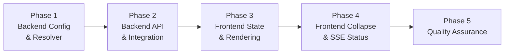
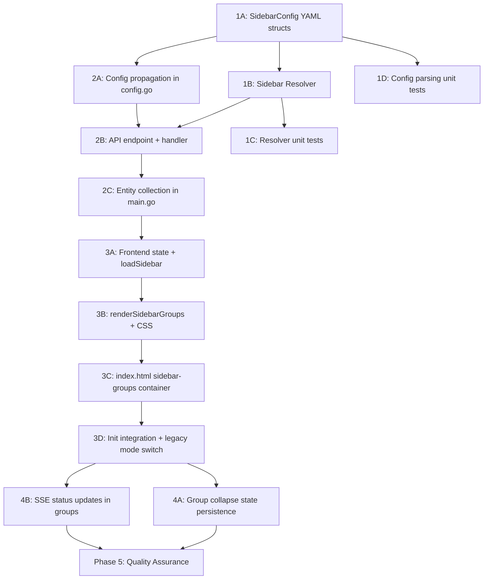

# Work Plan: Configurable Sidebar Groups Implementation

Created Date: 2026-02-18
Type: feature
Estimated Duration: 5-7 days
Estimated Impact: ~15 files (4 new, 11 modified)
Related Issue/PR: story/groups branch

## Related Documents
- Design Doc: [docs/design-sidebar-groups.md](/docs/design-sidebar-groups.md)
- ADR: [docs/adr-sidebar-groups.md](/docs/adr-sidebar-groups.md)

## Objective

Implement configurable sidebar groups allowing administrators to define logical groups in YAML config that combine any entity types (objects, launchers, dashboards, journals, servers) into collapsible sidebar sections. The server resolves a tree from YAML rules and known entities; the frontend renders the ready-made tree.

## Background

The sidebar currently has 5 hardcoded sections (Launchers, Objects, Journals, Dashboards, Servers) in a fixed order. In deployments with many entities across multiple servers, users need to group related items by logical subsystem (e.g., "Diesel Generator", "HVAC") regardless of entity type. Without group config, the sidebar must work identically to the current behavior.

## Phase Structure Diagram

## Task Dependency Diagram

## Risks and Countermeasures

### Technical Risks
- **Risk**: Frontend refactoring breaks existing sidebar rendering
  - **Impact**: High -- sidebar becomes non-functional in legacy mode
  - **Countermeasure**: Conditional rendering: legacy mode uses completely unmodified code paths. Group mode uses a new container (`#sidebar-groups`). E2E tests cover both modes.
  - **Detection**: E2E test with no sidebar config must pass all existing sidebar interactions.

- **Risk**: Glob pattern matching edge cases (overlapping patterns, special characters)
  - **Impact**: Medium -- entities may be assigned to wrong groups
  - **Countermeasure**: Comprehensive unit tests for `matchEntity()` with Go `path.Match` semantics. Document pattern behavior in config examples. Malformed patterns logged and skipped.
  - **Detection**: Unit tests in `resolver_test.go` covering wildcards, `@serverId`, malformed patterns.

- **Risk**: Async entity loading causes groups to render incomplete
  - **Impact**: Medium -- some entities missing from groups on page load
  - **Countermeasure**: Server resolves groups at startup after all managers are initialized, so all entities are known. Frontend receives a complete tree from a single API call.
  - **Detection**: E2E test verifying all entity types present in groups.

### Schedule Risks
- **Risk**: CSS styling complexity for type badges and sub-sections
  - **Impact**: Low -- visual polish may take longer
  - **Countermeasure**: Reuse existing CSS patterns (sidebar section header, collapse icon, status dot). Design Doc provides complete CSS specification.

## Implementation Phases

### Phase 1: Backend Config Parsing & Resolver (Estimated commits: 3)
**Purpose**: Implement the core backend logic -- YAML config structs and pattern matching resolver with full unit test coverage.

**Dependencies**: None (foundation phase)

#### Tasks
- [ ] **1A**: Add `SidebarGroupConfig` and `SidebarConfig` structs to `internal/config/yaml.go` + `Sidebar` field on `ConfigFile` struct
  - Completion: `SidebarGroupConfig{Name, Icon, Items, Patterns, GroupByType}` and `SidebarConfig{Groups}` structs compile
- [ ] **1B**: Create `internal/sidebar/resolver.go` with `SidebarItem`, `SidebarGroup` types, `Resolve()`, `matchEntity()`, `buildEntityId()` functions
  - `Resolve()` accepts `[]SidebarGroupConfig` + `[]SidebarItem`, returns `[]SidebarGroup`
  - First-match-wins ordering; auto-generated "Other" group for unmatched entities
  - Malformed patterns: `path.Match` returns error -> log warning, skip pattern
  - Completion: Functions compile and pass unit tests
- [ ] **1C**: Create `internal/sidebar/resolver_test.go` with unit tests
  - Test cases: glob `*` / `?` / prefix / suffix / middle wildcards
  - Test `@serverId` matching: with and without `@`
  - Test `items` exact name matching (case-sensitive, any type)
  - Test first-match-wins ordering (entity in first matching group only)
  - Test "Other" group generation for unmatched entities
  - Test empty/nil config (returns nil -- legacy mode)
  - Test malformed patterns (should not panic, logged and skipped)
  - Test `buildEntityId()` for all entity types (object, launcher, dashboard, journal, server)
  - Completion: `go test ./internal/sidebar/...` passes
- [ ] **1D**: Create `internal/config/sidebar_test.go` with YAML parsing tests
  - Test YAML parsing of `sidebar.groups` section
  - Test empty sidebar section -> nil
  - Test partial config (groups with only items, only patterns, mixed)
  - Completion: `go test ./internal/config/...` passes
- [ ] Quality check: `go vet ./...` and `go build ./...` pass

#### Phase 1 Completion Criteria
- [ ] `SidebarConfig` and `SidebarGroupConfig` structs defined in yaml.go
- [ ] `Resolve()` function correctly matches entities to groups with first-match-wins
- [ ] "Other" group generated for unmatched entities (omitted if empty)
- [ ] Malformed patterns logged and skipped without panic
- [ ] All unit tests pass: `go test ./internal/sidebar/... ./internal/config/...`
- [ ] `go vet ./...` passes

#### Operational Verification Procedures
1. Run `go test -v ./internal/sidebar/...` -- all tests pass
2. Run `go test -v ./internal/config/...` -- sidebar parsing tests pass
3. Run `go build ./...` -- builds without errors

---

### Phase 2: Backend API Endpoint & Integration (Estimated commits: 2)
**Purpose**: Wire the resolver into the application startup, collect entities from all managers, and expose `GET /api/sidebar`.

**Dependencies**: Phase 1 (resolver must be implemented)

#### Tasks
- [ ] **2A**: Update `internal/config/config.go` -- propagate `SidebarConfig` from YAML to `Config` struct
  - Add `Sidebar *config.SidebarConfig` field to `Config` struct (or reference from `ConfigFile`)
  - In `Parse()`, after loading YAML: `cfg.Sidebar = yamlConfig.Sidebar`
  - Completion: `Config.Sidebar` populated from YAML config
- [ ] **2B**: Create `internal/api/handlers_sidebar.go` with `GetSidebar()` handler
  - Add `sidebarGroups []sidebar.SidebarGroup` field to `Handlers` struct in `handlers.go`
  - Add `SetSidebarGroups(groups []sidebar.SidebarGroup)` setter
  - `GetSidebar()`: returns `{"groups": [...]}` when groups set, `{"groups": null}` when nil
  - Register `GET /api/sidebar` route in `server.go:setupRoutes()`
  - Completion: `curl /api/sidebar` returns valid JSON
- [ ] **2C**: Update `cmd/server/main.go` -- collect entities from all managers, call `Resolve()`, pass to handlers
  - After all managers initialized (serverMgr, launcherMgr, journalMgr, dashboardMgr):
    - Collect entities: objects from `serverMgr.GetAllObjectsWithServers()`, launchers from `launcherMgr`, journals from `journalMgr`, servers from config
    - Call `sidebar.Resolve(cfg.Sidebar.Groups, entities)`
    - Call `handlers.SetSidebarGroups(resolvedGroups)`
  - Only if `cfg.Sidebar != nil && len(cfg.Sidebar.Groups) > 0`
  - Logging: `slog.Info("Sidebar groups configured", "count", len(groups))`
  - Completion: Server starts and `GET /api/sidebar` returns resolved groups
- [ ] Quality check: `go vet ./...` and `go build ./...` pass

#### Phase 2 Completion Criteria
- [ ] `GET /api/sidebar` returns `{"groups": [...]}` when sidebar configured in YAML
- [ ] `GET /api/sidebar` returns `{"groups": null}` when no sidebar config
- [ ] Entities from all sources (objects, launchers, journals, servers) appear in resolved groups
- [ ] "Other" group contains unmatched entities
- [ ] `go test ./...` passes (all existing + new tests)
- [ ] `go build ./...` succeeds

#### Operational Verification Procedures
1. Create test YAML config with `sidebar.groups` section
2. Start server: `go run ./cmd/server -config test-config.yaml`
3. Run `curl http://localhost:8181/api/sidebar | jq .` -- verify groups JSON structure
4. Start server without sidebar config -- verify `{"groups": null}` response
5. Run `go test ./...` -- all tests pass

---

### Phase 3: Frontend State Loading & Group Rendering (Estimated commits: 3)
**Purpose**: Load sidebar config from API, render dynamic groups in sidebar, apply CSS styles.

**Dependencies**: Phase 2 (API endpoint must work)

#### Tasks
- [ ] **3A**: Update `ui/static/js/src/00-state.js` -- add `sidebarGroups` and `groupCollapseState` to state
  - `state.sidebarGroups = null` (null = legacy mode, array = group mode)
  - `state.groupCollapseState = {}` (groupName -> boolean)
  - Completion: State fields available globally
- [ ] **3B**: Create `ui/static/js/src/55-sidebar-groups.js` with rendering logic
  - `loadSidebar()` -- fetch `GET /api/sidebar`, set `state.sidebarGroups`
  - `renderSidebarGroups()` -- render all groups from state into `#sidebar-groups`
  - `renderSidebarGroup(group, container)` -- render single group (flat or group_by_type modes)
  - Entity type badges: `type-object`, `type-launcher`, `type-dashboard`, `type-journal`, `type-server`
  - Flat mode: `<ul>` with `<li>` items containing type badge + entity name + status dot
  - `group_by_type` mode: type sub-sections with lightweight sub-headers
  - Constants: `ENTITY_TYPE_ORDER`, `ENTITY_TYPE_LABELS`, badge abbreviations
  - Click handler: activate tab for entity (object -> openTab, launcher -> openLauncherTab, dashboard -> openDashboard, journal -> openJournal, server -> openServerTab)
  - User dashboards (localStorage): add to "Пользовательские" group on frontend
  - Completion: Groups render visually in sidebar with correct entity assignments
- [ ] **3C**: Update `ui/templates/index.html` -- add `
` container before hardcoded sections
  - Completion: Container exists in DOM, hidden by default
- [ ] **3D**: Update `ui/static/js/src/99-init.js` -- call `loadSidebar()` during init, conditionally switch between group mode and legacy mode
  - Call `loadSidebar()` before `fetchObjects()`
  - If `state.sidebarGroups !== null`: hide hardcoded sections, show `#sidebar-groups`, call `renderSidebarGroups()`
  - If `state.sidebarGroups === null`: show hardcoded sections (existing behavior)
  - Completion: Sidebar mode determined at init; correct mode renders
- [ ] **3E**: Add sidebar group CSS styles to `ui/static/css/style.css`
  - `.sidebar-group`, `.sidebar-group-header`, `.sidebar-group-count`
  - `.sidebar-group.collapsed`, `.collapse-icon` rotation
  - `.sidebar-group-item`, hover, active states
  - `.entity-type-badge` and type-specific colors (blue=object, purple=launcher, orange=dashboard, cyan=journal, green=server)
  - `.sidebar-type-section`, `.sidebar-type-header`, `.sidebar-type-items` (for group_by_type)
  - Completion: Groups look visually consistent with existing sidebar styling
- [ ] Run `make app` to regenerate `app.js`
- [ ] Quality check: `make build` succeeds

#### Phase 3 Completion Criteria
- [ ] Sidebar shows dynamic groups when API returns groups (AC: FR3)
- [ ] Sidebar shows legacy sections when API returns null (AC: FR6)
- [ ] Entity type badges displayed next to each item in flat mode (AC: FR7)
- [ ] Type sub-sections rendered when `group_by_type: true` (AC: FR9)
- [ ] "Other" group shown at bottom for ungrouped entities (AC: FR4)
- [ ] Group order matches YAML config order (AC: FR8)
- [ ] Clicking entity opens correct tab
- [ ] `make build` succeeds

#### Operational Verification Procedures
1. Start dev server with sidebar config: `docker-compose up dev-viewer -d --build`
2. Open `http://localhost:8181` in browser
3. Verify sidebar shows configured groups with correct entity assignments
4. Verify entity type badges are visible and correctly colored
5. Verify clicking an entity opens the correct tab
6. Verify group_by_type group shows type sub-headers
7. Remove sidebar config, restart -- verify legacy sidebar renders unchanged
8. Check browser console for `'Sidebar: group mode enabled'` or `'Sidebar: legacy mode'` logs

---

### Phase 4: Frontend Collapse State & SSE Status Updates (Estimated commits: 2)
**Purpose**: Persist group collapse state, update entity status indicators from SSE events.

**Dependencies**: Phase 3 (group rendering must work)

#### Tasks
- [ ] **4A**: Implement group collapse state persistence in `55-sidebar-groups.js` and `53-ui-settings.js`
  - Click on `.sidebar-group-header` toggles `.collapsed` class
  - Save collapse state to `localStorage` key `uniset-panel-group-collapse` as `{groupName: boolean}`
  - Restore collapse state on page load (in `renderSidebarGroups()`)
  - Update `saveSettings()` and `loadSettings()` in `53-ui-settings.js` to include `groupCollapseState`
  - Completion: Group collapse state persists across page reloads (AC: FR5)
- [ ] **4B**: Implement `updateGroupEntityStatus()` in `55-sidebar-groups.js`
  - Function: `updateGroupEntityStatus(entityType, entityName, serverId, status)`
  - Updates `.server-status-dot` on matching sidebar group item (by `data-type`, `data-name`, `data-server-id` attributes)
  - Status mapping: connected -> remove `.disconnected`, disconnected -> add `.disconnected`
  - Called from existing SSE event handlers (server_status, launcher_connection) -- add hooks
  - No re-render: DOM update only (querySelector on matching item)
  - Completion: Status indicator updates live without page reload (AC: FR3 last point, FR7)
- [ ] Run `make app` to regenerate `app.js`
- [ ] Quality check: `make build` succeeds

#### Phase 4 Completion Criteria
- [ ] Group collapse state persisted in localStorage and restored on reload (AC: FR5)
- [ ] Existing section collapse in legacy mode continues to work (AC: FR6)
- [ ] Entity status dot updates live when server disconnects/reconnects (AC: FR7)
- [ ] `make build` succeeds

#### Operational Verification Procedures
1. Open sidebar with groups -- collapse a group
2. Reload page -- verify group is still collapsed
3. Expand group -- reload -- verify group is expanded
4. Disconnect a server (stop UniSet2 backend) -- verify status dot turns disconnected in group
5. Reconnect server -- verify status dot recovers
6. Switch to legacy mode (no config) -- verify existing section collapse still works

---

### Phase 5: Quality Assurance (Estimated commits: 1-2)
**Purpose**: Final quality verification, all acceptance criteria met, E2E tests pass.

#### Tasks
- [ ] Verify all Design Doc acceptance criteria achieved:
  - [ ] FR1: YAML config with items, patterns, `@serverId`, malformed pattern handling
  - [ ] FR2: API returns groups or null
  - [ ] FR3: Dynamic group rendering, legacy mode, type badges, SSE status updates
  - [ ] FR4: "Other" group for ungrouped entities
  - [ ] FR5: Group collapse persistence
  - [ ] FR6: Backward compatibility (no config = current behavior)
  - [ ] FR7: Type badges and status indicators
  - [ ] FR8: Group order matches YAML
  - [ ] FR9: `group_by_type` sub-sections
- [ ] Run `go test ./...` -- all backend tests pass
- [ ] Run `go vet ./...` -- no issues
- [ ] Run `make build` -- successful build
- [ ] Run `make js-tests` -- all E2E tests pass (both modes)
- [ ] Verify backward compatibility: start without sidebar config, all existing E2E tests pass
- [ ] Verify error handling: malformed patterns logged, API failure degrades to legacy mode
- [ ] Review all new code for:
  - [ ] `escapeHtml()` on all user-facing strings in sidebar
  - [ ] CSS variables used (not hardcoded colors)
  - [ ] No `document.getElementById()` misuse (use `getElementInTab()` where appropriate)
  - [ ] Proper console logging per Design Doc specification

#### Phase 5 Completion Criteria
- [ ] All acceptance criteria from Design Doc satisfied
- [ ] `go test ./...` passes
- [ ] `go vet ./...` passes
- [ ] `make build` succeeds
- [ ] `make js-tests` passes
- [ ] No regressions in legacy mode

#### Operational Verification Procedures
1. Full E2E test run: `make js-tests`
2. Manual verification with test YAML config:
   - Groups render correctly with all entity types
   - Type sub-sections work
   - Collapse state persists
   - Entity clicks open correct tabs
   - SSE status updates propagate to group items
3. Manual verification without sidebar config:
   - Sidebar identical to current behavior
   - All existing interactions work

## Completion Criteria (Overall)
- [ ] All phases completed
- [ ] Each phase's operational verification procedures executed
- [ ] Design Doc acceptance criteria satisfied (FR1-FR9)
- [ ] Backend unit tests pass: `go test ./internal/sidebar/... ./internal/config/...`
- [ ] Full test suite: `go test ./...`
- [ ] Build: `make build`
- [ ] E2E: `make js-tests`
- [ ] Backward compatibility verified (legacy mode unchanged)
- [ ] User review approval obtained

## Progress Tracking

### Phase 1: Backend Config & Resolver
- Start:
- Complete:
- Notes:

### Phase 2: Backend API & Integration
- Start:
- Complete:
- Notes:

### Phase 3: Frontend State & Rendering
- Start:
- Complete:
- Notes:

### Phase 4: Frontend Collapse & SSE
- Start:
- Complete:
- Notes:

### Phase 5: Quality Assurance
- Start:
- Complete:
- Notes:

## Notes

### Key Implementation Constraints
- **No hot-reload**: Sidebar config is read once at startup. Server restart required for config changes.
- **First-match-wins**: Entity belongs to the first matching group only. Order of groups in YAML matters.
- **Server resolves tree**: Frontend does zero pattern matching. Server returns ready-made tree via API.
- **User dashboards**: Not known to server. Frontend adds them to "Пользовательские" group during rendering.
- **File numbering**: New JS file is `55-sidebar-groups.js` (UI functions range 50-59 per CLAUDE.md).
- **After JS changes**: Always run `make app` to regenerate `app.js` from src modules.

### Files Summary

| File | Action | Phase |
|------|--------|-------|
| `internal/config/yaml.go` | Modify (add SidebarConfig structs) | 1 |
| `internal/config/config.go` | Modify (propagate Sidebar field) | 2 |
| `internal/config/sidebar_test.go` | New (YAML parsing tests) | 1 |
| `internal/sidebar/resolver.go` | New (pattern matching + resolve) | 1 |
| `internal/sidebar/resolver_test.go` | New (unit tests) | 1 |
| `internal/api/handlers.go` | Modify (add sidebarGroups field + setter) | 2 |
| `internal/api/handlers_sidebar.go` | New (GetSidebar handler) | 2 |
| `internal/api/server.go` | Modify (add GET /api/sidebar route) | 2 |
| `cmd/server/main.go` | Modify (entity collection + resolve call) | 2 |
| `ui/static/js/src/00-state.js` | Modify (add sidebarGroups, groupCollapseState) | 3 |
| `ui/static/js/src/55-sidebar-groups.js` | New (group rendering logic) | 3-4 |
| `ui/static/js/src/53-ui-settings.js` | Modify (group collapse persistence) | 4 |
| `ui/static/js/src/99-init.js` | Modify (loadSidebar in init) | 3 |
| `ui/templates/index.html` | Modify (sidebar-groups container) | 3 |
| `ui/static/css/style.css` | Modify (group styles) | 3 |
