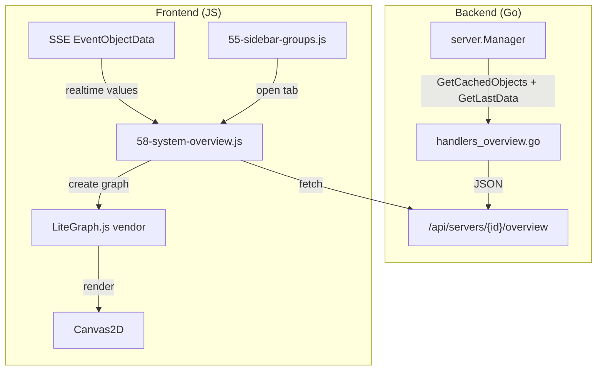
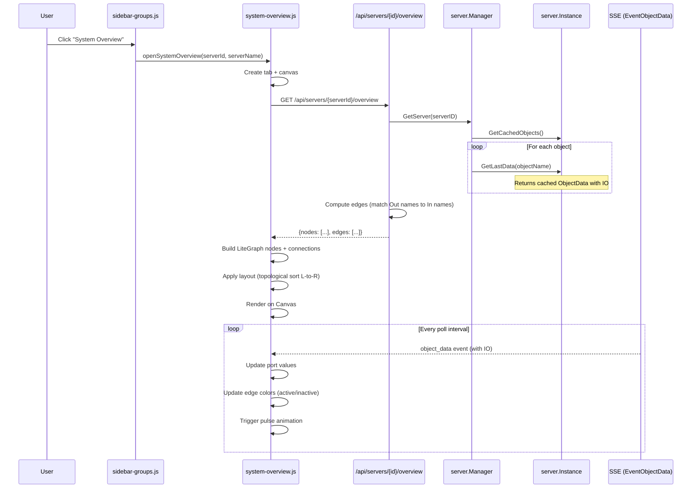

# System Overview -- Design Document

## Overview

System Overview -- диагностическая blueprint-диаграмма, визуализирующая межпроцессный поток данных UniSet2: процессы отображаются как узлы с портами входов/выходов, связи формируются по совпадению имен датчиков. Значения обновляются в реальном времени через SSE, активные связи подсвечиваются.

## Design Summary (Meta)

```yaml
design_type: "new_feature"
risk_level: "low"
complexity_level: "medium"
complexity_rationale: >
  (1) Требования F1-F8: агрегация данных по всем объектам сервера, вычисление графа связей,
  realtime-обновление через SSE, кастомный рендеринг LiteGraph.js узлов с портами.
  (2) Ограничения: Canvas2D (нет DOM внутри узлов), интеграция vendor-библиотеки в vanilla JS стек,
  необходимость собственного layout-алгоритма.
main_constraints:
  - "Canvas2D рендеринг (LiteGraph.js) -- стилизация только через Canvas API"
  - "Vanilla JS без фреймворков -- конкатенация модулей"
  - "Один Canvas на вкладку -- при переключении требуется пересоздание"
biggest_risks:
  - "Кастомизация LiteGraph.js узлов может потребовать более глубокого знания Canvas API"
  - "Большое количество портов на узле может сделать узлы слишком высокими"
unknowns:
  - "Точный формат отображения значений на портах при ограниченном пространстве"
  - "Поведение LiteGraph.js при частых обновлениях значений (SSE каждую секунду)"
```

## Background and Context

### Prerequisite ADRs

- `docs/plans/system-overview-adr.md`: Выбор LiteGraph.js для визуализации диаграммы (Canvas2D, MIT, ~480KB, zero deps)

### Agreement Checklist

#### Scope
- [x] Backend: новый endpoint `GET /api/servers/{id}/overview` для агрегации данных и вычисления связей
- [x] Frontend: новые JS-модули для рендеринга LiteGraph.js диаграммы
- [x] Sidebar: новая секция "System Overview" для каждого сервера
- [x] SSE: использование существующего `EventObjectData` для realtime-обновлений
- [x] Vendor: подключение LiteGraph.js как vendor-файл

#### Non-Scope (Не меняется)
- [x] Существующие рендереры объектов (Modbus, IONC, OPCUA и т.д.)
- [x] Существующая логика SSE hub и подписок
- [x] Dashboard система
- [x] Конфигурация серверов
- [x] Кросс-серверные связи (только один сервер на диаграмму)
- [x] Auto-layout с dagre/elkjs (отложено на будущее)

#### Constraints
- [x] Backward compatibility: Required -- существующие API и UI не должны измениться
- [x] Parallel operation: Yes -- новая фича добавляется параллельно существующим
- [x] Performance measurement: Required -- < 500ms backend, < 1s рендеринг для 20 процессов

#### Applicable Standards
- [x] Handler helpers: `writeJSON`, `writeError`, `requireObjectName` `[explicit]` - Source: CLAUDE.md
- [x] SSE event constants: `Event*` в `sse.go` `[explicit]` - Source: CLAUDE.md
- [x] JS нумерация файлов: 00-09 core, 10-29 renderers, 50-59 UI, 60-69 dashboard `[explicit]` - Source: CLAUDE.md
- [x] JS constants: `UPPER_CASE` в `00-constants.js` `[explicit]` - Source: CLAUDE.md
- [x] Vendor JS: подключение через `<script>` тег в `index.html` `[implicit]` - Evidence: Chart.js подключается через CDN `<script>` в `index.html` - Confirmed: Yes
- [x] Tab keys: `${serverId}:${objectName}` формат `[explicit]` - Source: CLAUDE.md
- [x] DOM search: `getElementInTab(tabKey, id)` для tab-scoped элементов `[explicit]` - Source: CLAUDE.md

### Problem to Solve

Инженеры видят каждый процесс UniSet2 изолированно в отдельной вкладке. Нет возможности увидеть системную картину: какие процессы связаны через общие датчики, как сигналы распространяются, какие связи активны. Для диагностики и проверки конфигурации нужна визуальная диаграмма потоков данных.

### Requirements

#### Functional Requirements (F1-F8 из PRD)

- F1: Backend endpoint агрегации данных
- F2: Blueprint-диаграмма на LiteGraph.js
- F3: Ребра связей между процессами
- F4: Отображение текущих значений на портах
- F5: Подсветка активных связей
- F6: Навигация (pan/zoom + fit-to-screen)
- F7: Sidebar секция
- F8: Scoping по серверу

#### Non-Functional Requirements

- **Performance**: Backend < 500ms, рендеринг < 1s для 20 процессов / 500 связей
- **Scalability**: До 50 процессов, 2000 IO-портов
- **Reliability**: При недоступности сервера -- кешированные данные + индикация "нет связи"
- **Maintainability**: Отдельные модули, следование существующим паттернам проекта

## Acceptance Criteria (AC) -- EARS Format

### F1: Backend endpoint

- [ ] **When** клиент запрашивает `GET /api/servers/{id}/overview`, система возвращает JSON со списком узлов (nodes) и ребер (edges)
- [ ] **When** у двух процессов есть совпадение `Out[sensorX]` процесса A и `In[sensorX]` процесса B, в ответе присутствует edge между ними
- [ ] **If** serverID не существует, **then** система возвращает HTTP 404 с JSON ошибкой
- [ ] **If** у процесса нет IO данных, **then** узел присутствует в ответе с пустыми inputs/outputs
- [ ] Время ответа endpoint < 500ms для системы из 20 процессов

### F2: Blueprint-диаграмма

- [ ] **When** пользователь открывает вкладку System Overview, система отображает canvas с диаграммой в стиле blueprint (темный фон, сетка)
- [ ] Каждый процесс сервера отображается как отдельный узел
- [ ] Входные порты (inputs) расположены слева узла, выходные (outputs) справа
- [ ] Имя процесса отображается в заголовке узла

### F3: Ребра связей

- [ ] **When** выходной порт процесса A и входной порт процесса B имеют одинаковое имя датчика, между ними отображается ребро
- [ ] Ребра не дублируются (одна связь = одно ребро)
- [ ] Процессы без связей отображаются как изолированные узлы

### F4: Текущие значения на портах

- [ ] Рядом с каждым портом отображается текущее значение датчика
- [ ] **When** приходит SSE событие `object_data`, значения на портах обновляются
- [ ] Задержка обновления не более poll interval + 1s

### F5: Подсветка активных связей

- [ ] **If** значение на порту ненулевое, **then** порт и ребро отображаются ярким цветом (зеленый)
- [ ] **If** значение нулевое, **then** порт и ребро серые/приглушенные
- [ ] **When** значение на порту изменяется, наблюдается анимация пульсации длительностью 0.5-1s

### F6: Навигация

- [ ] Pan (перетаскивание холста) работает через LiteGraph.js (левая кнопка мыши)
- [ ] Zoom (масштабирование) работает через колесо мыши
- [ ] **When** пользователь нажимает кнопку "Fit to Screen", диаграмма масштабируется и центрируется так, чтобы все узлы были видны

### F7: Sidebar секция

- [ ] Для каждого сервера в sidebar отображается секция "System Overview"
- [ ] **When** пользователь кликает на секцию, открывается вкладка с диаграммой данного сервера

### F8: Scoping по серверу

- [ ] На диаграмме отображаются только объекты выбранного сервера
- [ ] Процессы разных серверов не смешиваются на одной диаграмме

## Existing Codebase Analysis

### Implementation Path Mapping

| Type | Path | Description |
|------|------|-------------|
| Existing | `internal/uniset/types.go` | `IOData`, `IOVar` -- структуры IO данных |
| Existing | `internal/server/manager.go` | `GetLastData()`, `GetAllObjectsGrouped()`, `GetObjectData()` |
| Existing | `internal/server/instance.go` | `GetObjects()`, `GetCachedObjects()`, `GetObjectData()`, `GetLastData()` |
| Existing | `internal/api/sse.go` | `SSEHub`, `EventObjectData`, `BroadcastObjectDataWithServer()` |
| Existing | `internal/api/server.go` | Route registration (`setupRoutes`) |
| Existing | `internal/api/handlers.go` | `Handlers` struct, helper methods |
| Existing | `ui/static/js/src/55-sidebar-groups.js` | Sidebar rendering, `activateSidebarGroupItem()` |
| Existing | `ui/static/js/src/50-ui-tabs.js` | Tab management |
| Existing | `ui/templates/index.html` | HTML template, script tags |
| New | `internal/api/handlers_overview.go` | Handler для endpoint `/api/servers/{id}/overview` |
| New | `ui/static/js/vendor/litegraph.js` | Vendor-библиотека LiteGraph.js |
| New | `ui/static/js/src/58-system-overview.js` | Основной модуль System Overview (LiteGraph интеграция, рендеринг, SSE) |

### Similar Functionality Search

- **Dashboard**: Использует sidebar секцию и переключение view (`dashboardManager.switchView`). System Overview использует tab-based подход (как объекты), а не view-switching, поэтому реализация отличается.
- **Renderers**: Рендереры объектов (10-29) расширяют `BaseObjectRenderer`. System Overview не расширяет `BaseObjectRenderer`, т.к. это не рендерер отдельного объекта, а визуализация всего сервера.
- **Charts (`40-charts.js`)**: Используют Chart.js (Canvas) для графиков отдельных датчиков. Отличается доменом (временные ряды vs граф узлов).

**Решение**: Новая реализация -- нет аналогичной функциональности в проекте.

### Integration Points

- **Endpoint registration**: `internal/api/server.go` -> `setupRoutes()` -- добавить маршрут
- **Sidebar**: `ui/static/js/src/55-sidebar-groups.js` -> `activateSidebarGroupItem()` -- добавить case `'overview'`
- **SSE events**: `ui/static/js/src/04-sse.js` -- существующий `object_data` event handler уже вещает IO данные
- **Tab management**: `ui/static/js/src/50-ui-tabs.js` -- открытие/закрытие вкладки overview
- **index.html**: Добавить `<script>` тег для vendor/litegraph.js

### Code Inspection Evidence

| File/Function | Relevance |
|---------------|-----------|
| `internal/uniset/types.go:IOData` | Integration point -- структура IO с `In`/`Out` maps |
| `internal/uniset/types.go:IOVar` | Integration point -- поля `id`, `name`, `value` |
| `internal/server/manager.go:GetLastData()` | Integration point -- получение кешированных IO данных |
| `internal/server/manager.go:GetAllObjectsGrouped()` | Pattern reference -- группировка по серверам |
| `internal/server/instance.go:GetCachedObjects()` | Integration point -- список объектов сервера |
| `internal/server/instance.go:GetObjectData()` | Integration point -- получение данных объекта |
| `internal/api/handlers_dashboard.go` | Pattern reference -- структура handler'а |
| `internal/api/server.go:setupRoutes()` | Integration point -- регистрация маршрутов |
| `internal/api/sse.go:EventObjectData` | Integration point -- SSE event constant |
| `ui/static/js/src/55-sidebar-groups.js:activateSidebarGroupItem()` | Integration point -- обработка клика sidebar |
| `ui/static/js/src/04-sse.js` | Integration point -- обработка SSE событий |
| `ui/static/js/src/60-dashboard-base.js` | Pattern reference -- Canvas-based widget pattern |

## Design

### Architecture Overview



### Data Flow



### Change Impact Map

```yaml
Change Target: System Overview feature (new)
Direct Impact:
  - internal/api/handlers_overview.go (new file -- overview handler)
  - internal/api/server.go (add route registration)
  - ui/static/js/src/58-system-overview.js (new file -- frontend module)
  - ui/static/js/src/55-sidebar-groups.js (add 'overview' case in activateSidebarGroupItem)
  - ui/static/js/src/00-constants.js (add overview-related constants)
  - ui/templates/index.html (add litegraph.js script tag)
  - ui/static/js/vendor/litegraph.js (new vendor file)
Indirect Impact:
  - ui/static/js/app.js (regenerated via `make app`)
No Ripple Effect:
  - Existing renderers (10-29) -- не затрагиваются
  - Dashboard system (60-69) -- не затрагивается
  - SSE hub logic -- не меняется (используется существующий EventObjectData)
  - Backend server/manager -- не меняется (используются существующие методы)
  - Config system -- не меняется
```

### Integration Point Map

```yaml
Integration Point 1:
  Existing Component: internal/api/server.go:setupRoutes()
  Integration Method: Добавление строки регистрации маршрута
  Impact Level: Low (добавление, не изменение)
  Required Test Coverage: Маршрут отвечает 200 с валидным JSON

Integration Point 2:
  Existing Component: ui/static/js/src/55-sidebar-groups.js:activateSidebarGroupItem()
  Integration Method: Добавление case 'overview' в switch
  Impact Level: Low (добавление, не изменение)
  Required Test Coverage: Клик открывает вкладку

Integration Point 3:
  Existing Component: ui/static/js/src/04-sse.js (EventObjectData handler)
  Integration Method: Вызов callback для обновления overview портов (если вкладка открыта)
  Impact Level: Low (Read-Only -- чтение существующих SSE событий)
  Required Test Coverage: Значения на портах обновляются при SSE

Integration Point 4:
  Existing Component: ui/templates/index.html
  Integration Method: Добавление script tag для vendor/litegraph.js
  Impact Level: Low (добавление)
  Required Test Coverage: LiteGraph.js загружается без ошибок
```

### Main Components

#### Component 1: Backend Handler (`handlers_overview.go`)

- **Responsibility**: Агрегация IO-данных всех объектов сервера, вычисление связей (edges) по совпадению имен
- **Interface**:
  ```
  GET /api/servers/{id}/overview
  Response: OverviewResponse { nodes: []OverviewNode, edges: []OverviewEdge, serverName: string }
  ```
- **Dependencies**: `server.Manager` (через `h.serverMgr`)

#### Component 2: Frontend Module (`58-system-overview.js`)

- **Responsibility**: Рендеринг LiteGraph.js диаграммы, обработка SSE обновлений, управление вкладкой
- **Interface**:
  - `openSystemOverview(serverId, serverName)` -- открытие/переключение вкладки
  - SSE callback для обновления значений на портах
- **Dependencies**: LiteGraph.js (global `LiteGraph`, `LGraph`, `LGraphCanvas`), tab management (`50-ui-tabs.js`)

#### Component 3: LiteGraph.js Custom Node Type (`UniSetProcessNode`)

- **Responsibility**: Кастомный рендеринг узла процесса с именованными портами и значениями
- **Interface**: Регистрация через `LiteGraph.registerNodeType("uniset/process", UniSetProcessNode)`
- **Dependencies**: LiteGraph.js API

### Data Representation Decision

| Criterion | Assessment | Reason |
|-----------|-----------|--------|
| Semantic Fit | No | Существующие структуры (`IOData`, `ObjectData`) -- raw данные объекта, не граф связей |
| Responsibility Fit | No | Overview -- агрегация по серверу (cross-object), а не per-object данные |
| Lifecycle Fit | No | Overview вычисляется on-demand, а `ObjectData` кешируется поллером |
| Boundary/Interop Cost | Low | Overview использует `IOData` как input, но output (граф) -- новая структура |

**Decision**: New -- создать отдельные Go-структуры `OverviewNode` и `OverviewEdge` для API ответа. `IOData`/`IOVar` используются как источник данных, но формат ответа -- специфичный для overview (граф, а не raw объект).

### Contract Definitions

#### Backend API Contract

```go
// OverviewPort -- порт (input/output) узла
type OverviewPort struct {
    Name  string      `json:"name"`
    Value interface{} `json:"value"`
}

// OverviewNode -- узел (процесс) на диаграмме
type OverviewNode struct {
    Name    string         `json:"name"`
    Inputs  []OverviewPort `json:"inputs"`
    Outputs []OverviewPort `json:"outputs"`
}

// OverviewEdge -- связь между портами
type OverviewEdge struct {
    FromNode string `json:"fromNode"` // имя процесса-источника
    FromPort string `json:"fromPort"` // имя выходного порта
    ToNode   string `json:"toNode"`   // имя процесса-приемника
    ToPort   string `json:"toPort"`   // имя входного порта
}

// OverviewResponse -- ответ endpoint
type OverviewResponse struct {
    ServerName string         `json:"serverName"`
    Nodes      []OverviewNode `json:"nodes"`
    Edges      []OverviewEdge `json:"edges"`
}
```

### Data Contract

#### handlers_overview.go

```yaml
Input:
  Type: HTTP GET request with serverID path parameter
  Preconditions: serverMgr != nil, serverID exists in manager
  Validation: Check serverMgr != nil, check server exists

Output:
  Type: OverviewResponse JSON
  Guarantees:
    - nodes contains all objects of the server (even those without IO)
    - edges contains only valid connections (both fromNode and toNode exist)
    - edges are deduplicated
    - port values are current (from cache)
  On Error:
    - serverMgr == nil: 503 {"error": "server manager not initialized"}
    - server not found: 404 {"error": "server not found"}
    - server objects unavailable: 503 {"error": "unable to retrieve objects"}

Invariants:
  - Every edge references existing nodes (fromNode and toNode are in nodes list)
  - Port names in edges match port names in corresponding nodes
```

### Field Propagation Map

| Field | Boundary | Status | Detail |
|-------|----------|--------|--------|
| `IOVar.Name` | Instance -> Handler | preserved | Becomes `OverviewPort.Name` |
| `IOVar.Value` | Instance -> Handler | preserved | Becomes `OverviewPort.Value` |
| `IOVar.ID` | Instance -> Handler | dropped | Not needed for overview (ports identified by name) |
| `IOVar.Comment` | Instance -> Handler | dropped | Not needed for overview visualization |
| `IOData.In` | Handler -> API response | transformed | Map -> sorted slice of `OverviewPort` (inputs) |
| `IOData.Out` | Handler -> API response | transformed | Map -> sorted slice of `OverviewPort` (outputs) |
| `OverviewPort.Name` | API -> Frontend | preserved | Displayed on port label |
| `OverviewPort.Value` | API -> Frontend | preserved | Displayed next to port, updated via SSE |
| `OverviewEdge.*` | API -> Frontend | preserved | Used to create LiteGraph connections |

### Connection Computation Algorithm

```
Алгоритм вычисления связей (edges):

1. Получить список объектов сервера: objects = instance.GetCachedObjects()
2. Для каждого объекта получить кешированные данные: data = instance.GetLastData(objectName)
3. Построить индекс выходов: outputIndex = map[sensorName] -> []{ objectName, portName }
   - Для каждого объекта, для каждого Out[sensorName]: добавить в индекс
4. Для каждого объекта, для каждого In[sensorName]:
   - Если sensorName есть в outputIndex:
     - Для каждого источника в outputIndex[sensorName]:
       - Создать edge: { fromNode: source.objectName, fromPort: sensorName,
                          toNode: current.objectName, toPort: sensorName }
5. Дедупликация не требуется, т.к. каждая пара (fromNode+fromPort, toNode+toPort) уникальна
```

### Layout Algorithm (MVP)

```
Простое послойное размещение (topological sort left-to-right):

1. Построить направленный граф из edges
2. Выполнить топологическую сортировку (Kahn's algorithm)
   - Если граф содержит циклы: fallback на алфавитный порядок
3. Назначить слои (layers): узлы без входящих ребер -> layer 0, далее BFS
4. Расположить узлы:
   - X = layer * OVERVIEW_NODE_HORIZONTAL_SPACING
   - Y = indexInLayer * OVERVIEW_NODE_VERTICAL_SPACING
5. Передать координаты LiteGraph через node.pos = [x, y]
```

### SSE Integration (Realtime Updates)

System Overview не создает новых SSE подписок. Фронтенд подписывается на существующие `object_data` события, которые уже содержат IO данные для наблюдаемых (watched) объектов.

**Важное ограничение**: `EventObjectData` приходит только для watched-объектов (тех, на которые пользователь подписался через открытие вкладки объекта). Для System Overview нужны данные **всех** объектов сервера.

**Решение**: GET endpoint `/api/servers/{id}/overview` как side-effect вызывает `instance.Watch()` для всех объектов сервера. Это избавляет фронтенд от N последовательных POST-запросов. Watch идемпотентен -- повторные вызовы безопасны.

**При закрытии вкладки overview**: НЕ вызываем unwatch. Причина: `Watch()`/`Unwatch()` не имеют reference counting -- unwatch из overview отменит подписку и для других открытых вкладок. SSE-подписки очищаются автоматически при disconnect. Дополнительный SSE-трафик для watched объектов минимален (используются существующие events).

Обновление значений:
```
SSE event: object_data { serverID, objectName, data: { io: { in: {...}, out: {...} } } }

1. Проверить: есть ли открытая вкладка overview для данного serverID
2. Если да: найти узел с именем objectName в графе
3. Обновить значения на портах узла
4. Пересчитать цвета ребер (active/inactive)
5. Если значение изменилось -- запустить pulse анимацию
```

### Custom LiteGraph Node Type

```javascript
// Регистрация кастомного типа узла
function UniSetProcessNode() {
    // Порты добавляются динамически при загрузке данных
    this.portValues = {};    // name -> value
    this.prevValues = {};    // name -> previous value (для пульсации)
    this.pulseTimers = {};   // name -> timer id
}

UniSetProcessNode.title = "Process";

UniSetProcessNode.prototype.onDrawForeground = function(ctx) {
    // Custom drawing: значения рядом с портами, подсветка активных
    // ctx -- Canvas2D context
    for (let i = 0; i < this.inputs.length; i++) {
        const input = this.inputs[i];
        const value = this.portValues[input.name];
        const isActive = value !== 0 && value !== null && value !== undefined;
        // Рисуем значение рядом с портом
        ctx.fillStyle = isActive ? OVERVIEW_ACTIVE_COLOR : OVERVIEW_INACTIVE_COLOR;
        ctx.fillText(formatPortValue(value), ...);
    }
    // Аналогично для outputs
};

LiteGraph.registerNodeType("uniset/process", UniSetProcessNode);
```

### Pulse Animation

```
Пульсация при изменении значения:
1. При обновлении значения сравнить с предыдущим
2. Если значение изменилось:
   a. Установить флаг pulse = true на порте/ребре
   b. Через OVERVIEW_PULSE_DURATION_MS сбросить флаг
3. При рендеринге: если pulse == true, увеличить lineWidth ребра и яркость цвета
4. LiteGraph.js автоматически перерисовывает canvas (requestAnimationFrame)
```

### Error Handling

| Ситуация | Поведение |
|----------|-----------|
| `serverMgr == nil` | HTTP 503 `{"error": "server manager not initialized"}` |
| Server not found | HTTP 404 `{"error": "server not found"}` |
| Server disconnected | Вернуть данные из кеша (GetCachedObjects + GetLastData), пустые IO |
| Object has no IO | Узел без портов (информационно) |
| LiteGraph.js not loaded | Console error, показать сообщение "LiteGraph.js not loaded" в tab content |
| Canvas resize | Обработка `ResizeObserver` для пересчета размера canvas |

### Interface Change Impact Analysis

| Existing Operation | New Operation | Conversion Required | Adapter Required | Compatibility Method |
|-------------------|---------------|-------------------|------------------|---------------------|
| `setupRoutes()` | `setupRoutes()` + new route | No | No | Adding line |
| `activateSidebarGroupItem()` | + case 'overview' | No | No | Adding case |
| SSE `object_data` handling | + overview update callback | No | No | Adding listener |

### Integration Boundary Contracts

```yaml
Boundary: Backend API -> Frontend
  Input: HTTP GET /api/servers/{id}/overview
  Output: JSON OverviewResponse (sync, single response)
  On Error: JSON {"error": "..."} with appropriate HTTP status

Boundary: SSE -> Frontend Overview
  Input: SSE event object_data with io field
  Output: Visual update on canvas (async, push)
  On Error: Ignore events for non-existent overview tabs

Boundary: Frontend -> LiteGraph.js
  Input: OverviewResponse data (nodes, edges)
  Output: Canvas2D rendering (sync after data load)
  On Error: Console error if LiteGraph API fails
```

## Implementation Plan

### Implementation Approach

**Selected Approach**: Vertical Slice
**Selection Reason**: Фича автономна (не зависит от других фич в разработке), результат ценен как единое целое (диаграмма без одного из компонентов бесполезна). Естественный порядок: backend -> frontend -> SSE integration.

### Technical Dependencies and Implementation Order

#### 1. Vendor file (LiteGraph.js)

- **Technical Reason**: Frontend модуль зависит от LiteGraph.js API
- **Dependent Elements**: `58-system-overview.js`, `index.html`

#### 2. Backend handler (`handlers_overview.go`)

- **Technical Reason**: Frontend не может рендерить диаграмму без данных
- **Dependent Elements**: Frontend fetch call
- **Prerequisites**: Vendor file (для итоговой проверки)

#### 3. Route registration + constants

- **Technical Reason**: Endpoint должен быть доступен
- **Prerequisites**: Handler implementation

#### 4. Frontend module (`58-system-overview.js`)

- **Technical Reason**: Основная логика визуализации
- **Prerequisites**: LiteGraph.js vendor, backend endpoint

#### 5. Sidebar integration + SSE integration

- **Technical Reason**: Точка входа для пользователя + realtime обновления
- **Prerequisites**: Frontend module

### Integration Points

**Integration Point 1: Backend Route**
- Components: `handlers_overview.go` -> `server.go:setupRoutes()`
- Verification: `curl /api/servers/{id}/overview` возвращает валидный JSON

**Integration Point 2: Sidebar -> Tab**
- Components: `55-sidebar-groups.js` -> `58-system-overview.js`
- Verification: Клик на "System Overview" в sidebar открывает вкладку с canvas

**Integration Point 3: SSE -> Canvas Update**
- Components: `04-sse.js` -> `58-system-overview.js`
- Verification: При изменении значения датчика на порте обновляется отображение

## File Map

| File | Action | Description |
|------|--------|-------------|
| `ui/static/js/vendor/litegraph.js` | Create | Vendor-копия LiteGraph.js (~480KB) |
| `internal/api/handlers_overview.go` | Create | Handler для `GET /api/servers/{id}/overview` |
| `ui/static/js/src/58-system-overview.js` | Create | Frontend модуль: LiteGraph интеграция, рендеринг, SSE, layout |
| `internal/api/server.go` | Modify | Добавить маршрут в `setupRoutes()` |
| `ui/static/js/src/00-constants.js` | Modify | Добавить константы overview |
| `ui/static/js/src/55-sidebar-groups.js` | Modify | Добавить case 'overview' в `activateSidebarGroupItem()` |
| `ui/templates/index.html` | Modify | Добавить `<script src="/static/js/vendor/litegraph.js">` |

### Constants to Add (`00-constants.js`)

```javascript
// System Overview
const OVERVIEW_NODE_WIDTH = 250;
const OVERVIEW_NODE_HORIZONTAL_SPACING = 350;
const OVERVIEW_NODE_VERTICAL_SPACING = 150;
const OVERVIEW_ACTIVE_COLOR = '#4CAF50';
const OVERVIEW_INACTIVE_COLOR = '#666';
const OVERVIEW_PULSE_DURATION_MS = 800;
const OVERVIEW_FIT_PADDING = 50;
```

## Test Strategy

### Unit Tests (Go)

- `handlers_overview_test.go`: Тестирование handler'а с mock-сервером
  - Test: пустой сервер (0 объектов) -> пустой nodes/edges
  - Test: 2 объекта с совпадающими IO -> корректные edges
  - Test: объект без IO -> узел с пустыми inputs/outputs
  - Test: несуществующий serverID -> 404
  - Test: serverMgr == nil -> 503

### E2E Tests (Playwright)

- Test: Открытие вкладки System Overview из sidebar
- Test: Отображение узлов и связей на canvas
- Test: Fit-to-screen кнопка
- Test: Обновление значений через SSE (mock-server)

### Performance Tests

- Измерение времени ответа endpoint при 20 объектах
- Визуальная проверка рендеринга при 50 узлах

## Security Considerations

- Endpoint read-only, не требует control access
- Используются существующие механизмы (нет аутентификации в MVP)
- Данные IO кешируются в памяти сервера, не содержат секретов

## Future Extensibility

- **Auto-layout (F9)**: Замена простого topological sort на dagre/elkjs для оптимального размещения
- **Drag + save (F10)**: Сохранение позиций узлов в localStorage через LiteGraph.js API (serialize/configure)
- **Click to navigate (F11)**: Обработчик `onNodeDblClick` для перехода во вкладку объекта
- **Filter/search (F12)**: Overlay input с фильтрацией узлов и подсветкой совпадений
- **Signal tracing (F13)**: Подсветка полного пути через несколько узлов при клике на ребро

## Risks and Mitigation

| Risk | Impact | Probability | Mitigation |
|------|--------|-------------|------------|
| LiteGraph.js custom drawing API недостаточен | High | Low | Протестировать `onDrawForeground` в spike перед реализацией |
| Большие узлы (20+ портов) не помещаются на экране | Medium | Medium | Ограничить отображаемые порты (N первых + "..."), fit-to-screen |
| Watch при открытии overview создает нагрузку | Low | Low | Watch вызывается на backend как side-effect GET overview (один HTTP запрос); Watch идемпотентен |
| SSE обновления каждую секунду для всех объектов | Medium | Low | Используется существующий механизм, нагрузка пропорциональна числу объектов |

## References

- [LiteGraph.js -- GitHub](https://github.com/jagenjo/litegraph.js)
- [LiteGraph.js Wiki -- Creating custom Nodes](https://github.com/jagenjo/litegraph.js/wiki/Creating-custom-Nodes)
- [LiteGraph.js Guides](https://github.com/jagenjo/litegraph.js/blob/master/guides/README.md)
- [LiteGraph.js -- npm](https://www.npmjs.com/package/litegraph.js)
- [Comfy-Org/litegraph.js fork](https://github.com/Comfy-Org/litegraph.js)
- PRD: `docs/plans/system-overview-prd.md`
- ADR: `docs/plans/system-overview-adr.md`

## Update History

| Date | Version | Changes | Author |
|------|---------|---------|--------|
| 2026-03-11 | 1.0 | Initial version | Claude Opus 4.6 |
