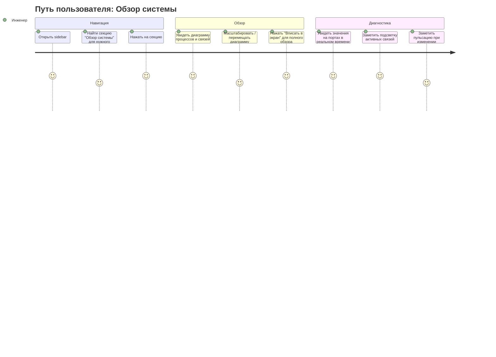
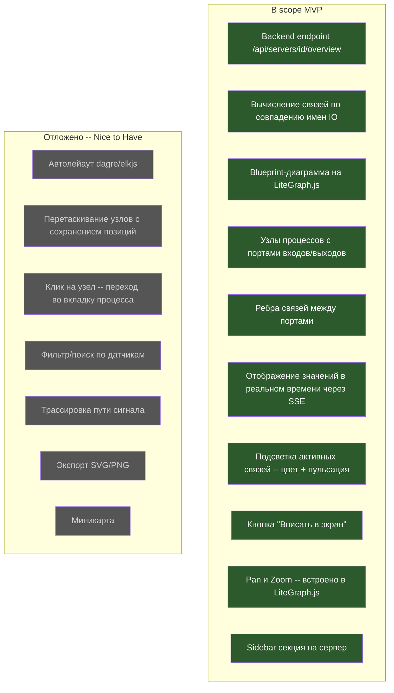

# PRD: System Overview (Обзор системы)

## Overview

### Краткое описание
Диагностическая диаграмма в стиле blueprint, визуализирующая межпроцессный поток данных в системе UniSet2 -- процессы (UObject'ы) отображаются как узлы с портами входов/выходов, а совпадение имен сенсоров между выходами одного процесса и входами другого формирует связи (ребра) между узлами.

### Предпосылки
Инженеры, работающие со сложными SCADA-системами на базе UniSet2, видят каждый процесс изолированно -- в отдельной вкладке с таблицами датчиков. Нет возможности увидеть системную картину: как сигналы распространяются между процессами, какие процессы связаны через общие датчики, какие связи сейчас активны. Для диагностики аварий и проверки корректности конфигурации требуется визуальное представление потоков данных на уровне всей системы (одного uniset-config проекта = одного сервера).

## User Stories

### Целевые пользователи
- **Инженер-наладчик SCADA** -- настраивает и вводит в эксплуатацию системы UniSet2
- **Инженер технической поддержки** -- диагностирует проблемы в работающих системах
- **Разработчик UniSet2-проекта** -- проектирует связи между процессами

### Пользовательские истории

```
Как инженер-наладчик
Я хочу видеть все процессы одного сервера и их связи на одной диаграмме
Чтобы быстро проверить корректность конфигурации потоков данных
```

```
Как инженер техподдержки
Я хочу видеть текущие значения сигналов на связях между процессами в реальном времени
Чтобы быстро локализовать, на каком участке цепочки возникает проблема
```

```
Как инженер техподдержки
Я хочу видеть визуальную индикацию активных связей (ненулевые значения)
Чтобы мгновенно отличить работающие каналы от неактивных
```

```
Как разработчик UniSet2-проекта
Я хочу видеть общую структуру связей между процессами
Чтобы планировать изменения с пониманием возможного воздействия
```

### Сценарии использования

1. **Проверка конфигурации при пуско-наладке**: Инженер открывает System Overview для сервера, видит все процессы и связи, проверяет, что ожидаемые связи существуют, а лишних нет.

2. **Диагностика аварии**: Инженер видит, что значение на выходном порту процесса A не ноль, но на входном порту процесса B (связанном с тем же датчиком) значение ноль или отсутствует -- локализует проблему на участке между процессами.

3. **Обзор активности системы**: Инженер открывает диаграмму и по цветовой индикации сразу видит, какие связи активны (передают ненулевые значения), а какие "спят".

## Диаграммы

### Путь пользователя (User Journey)



### Граница scope (Scope Boundary)



## Функциональные требования

### Must Have (MVP)

- [ ] **F1: Backend endpoint агрегации данных**
  Новый endpoint `GET /api/servers/{serverID}/overview` (где `serverID` — хэш-идентификатор сервера, например `77b5af18`) возвращает:
  - Список процессов (объектов) сервера с их IO (inputs/outputs)
  - Вычисленные связи: если `Out[sensorName]` процесса A совпадает с `In[sensorName]` процесса B -- это связь
  - Текущие значения каждого IO-порта
  - AC: Endpoint возвращает JSON со списком узлов и ребер; при наличии 2+ процессов с общими датчиками в ответе присутствуют соответствующие edges; время ответа < 500ms для системы из 20 процессов

- [ ] **F2: Blueprint-диаграмма на LiteGraph.js**
  Рендеринг диаграммы в стиле blueprint (темный фон, цветные узлы) с использованием библиотеки [LiteGraph.js](https://github.com/jagenjo/litegraph.js) (Canvas2D, MIT, без зависимостей).
  - Каждый процесс (UObject) -- отдельный узел
  - Входные порты (inputs) слева, выходные порты (outputs) справа
  - Имя процесса в заголовке узла
  - AC: Диаграмма отображает все процессы сервера как узлы; каждый порт соответствует одному IO-датчику; визуальный стиль -- blueprint (темный фон, сетка)

- [ ] **F3: Ребра связей между процессами**
  Автоматическое построение ребер (connection edges) между выходным портом одного процесса и входным портом другого, когда имя датчика совпадает.
  - AC: Для каждой пары (процесс A output sensorX, процесс B input sensorX) отображается ребро; ребра не дублируются; процессы без связей отображаются как изолированные узлы

- [ ] **F4: Отображение текущих значений на портах**
  Рядом с каждым портом (input/output) отображается текущее значение датчика, обновляемое в реальном времени через SSE (используется существующий `EventObjectData`).
  - AC: Значения обновляются при получении SSE события `object_data`; задержка обновления не более poll interval + 1s (по умолчанию <= 2s)

- [ ] **F5: Подсветка активных связей**
  - Ненулевые значения: порт и ребро отображаются ярким цветом (например, зеленым)
  - Нулевые значения: порт и ребро серые/приглушенные
  - При изменении значения: кратковременная пульсация (pulse animation) на порту/ребре
  - AC: Визуально отличимы активные (ненулевые) и неактивные (нулевые) связи; при изменении значения наблюдается анимация пульсации длительностью 0.5-1 секунда

- [ ] **F6: Навигация по диаграмме**
  - Pan (перетаскивание холста) и Zoom (колесо мыши) -- встроенная функциональность LiteGraph.js
  - Кнопка "Вписать в экран" (fit-to-screen): масштабирует и центрирует диаграмму так, чтобы все узлы были видны
  - AC: Zoom работает от 10% до 300%; кнопка fit-to-screen показывает все узлы с отступами

- [ ] **F7: Sidebar секция "Обзор системы"**
  Новая секция в sidebar для каждого сервера (по аналогии с Dashboard).
  - Появляется в sidebar под именем "Обзор системы" / "System Overview"
  - При клике открывает вкладку с диаграммой
  - AC: Секция видна в sidebar для каждого сервера; клик открывает соответствующую вкладку с диаграммой

- [ ] **F8: Scoping по серверу**
  Диаграмма показывает только процессы одного сервера (одного uniset-config проекта). Процессы разных серверов не смешиваются.
  - AC: На диаграмме отображаются только объекты, принадлежащие выбранному серверу

### Should Have (отложено на следующую итерацию)

- [ ] **F9: Автоматический layout**
  Алгоритм расположения узлов с минимизацией пересечений ребер (dagre или elkjs). В MVP -- простое послойное размещение слева направо.

- [ ] **F10: Перетаскивание узлов с сохранением позиций**
  Пользователь может перетащить узел, позиция сохраняется в localStorage.

- [ ] **F11: Навигация по клику на узел**
  Клик на узел процесса открывает соответствующую вкладку объекта.

### Could Have (будущее)

- [ ] **F12: Фильтр и поиск**
  Поиск по имени датчика с подсветкой совпадений на диаграмме.

- [ ] **F13: Трассировка пути сигнала**
  Выделение полного пути сигнала через несколько процессов.

- [ ] **F14: Экспорт диаграммы**
  Экспорт текущего вида как SVG или PNG.

- [ ] **F15: Миникарта**
  Миниатюра всей диаграммы для навигации в больших системах.

### Out of Scope

- **Кросс-серверные связи**: Связи между процессами разных серверов. Причина: значительно усложняет логику, нет подтвержденной потребности.
- **Редактирование конфигурации**: Создание/удаление связей через UI. Причина: связи определяются конфигурацией UniSet2, а не uniset-panel.
- **3D-визуализация**: Объемное представление диаграммы. Причина: избыточно для задачи диагностики.
- **Исторические данные на диаграмме**: Отображение графиков изменения значений прямо на ребрах. Причина: сложность; для этого есть Charts.

## Нефункциональные требования

### Производительность
- Время рендеринга диаграммы: < 1 секунды для системы из 20 процессов с 500 связями
- Время ответа backend endpoint: < 500ms для 20 процессов
- Обновление значений через SSE: задержка не более poll interval (по умолчанию 1 секунда)
- Плавный pan/zoom при 60 FPS (обеспечивается Canvas2D рендерингом LiteGraph.js)

### Масштабируемость
- Корректная работа с системами до 50 процессов и до 2000 IO-портов суммарно
- При превышении лимитов -- деградация без ошибок (возможны замедления рендеринга)

### Совместимость
- Поддержка браузеров: Chrome 90+, Firefox 90+, Edge 90+ (Canvas2D)
- Корректная работа при изменении размера окна (resize)
- Работа через nginx reverse proxy (SSE через существующий механизм)

### Безопасность
- Используются существующие механизмы аутентификации/авторизации uniset-panel
- SSE события используют существующую модель подписок
- Endpoint `/api/servers/{id}/overview` работает только на чтение; дополнительных требований к безопасности для MVP нет

### Доступность (Accessibility)
- Canvas2D рендеринг (LiteGraph.js) не поддерживает screen reader'ы. Это допустимо для MVP, т.к. функция является визуальным диагностическим инструментом, дополняющим текстовые табличные представления

### Надежность
- При недоступности сервера: диаграмма показывает последние кешированные данные с индикацией "нет связи"
- При отсутствии IO у процессов: узел отображается без портов (информационно)

## Критерии приемки (Acceptance Criteria)

### Количественные метрики
1. Диаграмма отображает 100% процессов выбранного сервера
2. Все связи (совпадения input/output по имени датчика) визуализированы без пропусков
3. Значения на портах обновляются в реальном времени с задержкой <= poll interval + 1s
4. Время загрузки диаграммы < 2 секунд (backend + рендеринг) для типичной системы (10-20 процессов)

### Качественные метрики
1. Инженер может за 30 секунд определить, какие процессы связаны с конкретным процессом
2. Визуальная индикация активности позволяет мгновенно отличить работающие каналы от неактивных
3. Диаграмма читаема без специальной подготовки (интуитивно понятные узлы и связи)

## Технические ограничения

### Зависимости
- **LiteGraph.js** ([GitHub](https://github.com/jagenjo/litegraph.js)): ~480KB, MIT лицензия, Canvas2D, без внешних зависимостей. Подключается как vendor-файл в `ui/static/js/vendor/`.
- **Существующие данные IO**: `IOData` struct с `In`/`Out` maps в `internal/uniset/types.go`
- **Существующий SSE**: `EventObjectData` уже вещает IO данные (используются для обновления значений)
- **Существующий Manager**: `GetLastData()`, `GetAllObjectsGrouped()` в `internal/server/manager.go`

### Ограничения
- LiteGraph.js использует Canvas2D -- нет доступа к DOM-элементам внутри узлов (стилизация через API библиотеки)
- Простой layout (left-to-right) в MVP может давать пересечения ребер при сложных конфигурациях
- Один Canvas на вкладку -- при переключении вкладок требуется пересоздание или кеширование состояния

### Предположения
- У каждого процесса есть IO данные (поле `io` в ObjectData) -- если IO нет, узел отображается без портов
- Связи определяются строгим совпадением имен датчиков (case-sensitive)
- Количество процессов на одном сервере обычно 5-30, редко более 50

### Риски и митигация

| Риск | Влияние | Вероятность | Митигация |
|------|---------|-------------|-----------|
| LiteGraph.js не поддерживает нужную кастомизацию узлов | Высокое | Низкая | Библиотека имеет развитый API кастомизации; при необходимости -- fork или custom drawing |
| Большое количество связей делает диаграмму нечитаемой | Среднее | Средняя | Fit-to-screen + zoom; в будущем -- фильтрация и группировка |
| Производительность Canvas при 50+ узлах и 2000+ портов | Среднее | Низкая | LiteGraph.js оптимизирован для сотен узлов; при проблемах -- viewport culling |
| SSE нагрузка при обновлении всех портов | Низкое | Низкая | Используются существующие SSE события (не создает дополнительной нагрузки) |
| Прекращение поддержки LiteGraph.js | Среднее | Средняя | Библиотека самодостаточна (~480KB vendor-файл), не зависит от npm в runtime. При прекращении поддержки — vendored копия продолжает работать; для багфиксов — fork или миграция на альтернативу |

## Решённые вопросы

- **Позиционирование узлов в MVP**: Топологическая сортировка с послойным размещением left-to-right; для циклических графов -- fallback на размещение по алфавиту
- **Формат отображения значений**: Имя датчика на порту + числовое значение; при нехватке места -- сокращение имени; tooltip с полным именем при наведении

## Неопределенные вопросы

Нет открытых вопросов.

## Приложение

### Ссылки
- [LiteGraph.js -- GitHub](https://github.com/jagenjo/litegraph.js)
- [LiteGraph.js -- npm](https://www.npmjs.com/package/litegraph.js)
- Существующие типы: `internal/uniset/types.go` (`IOData`, `IOVar`)
- Server Manager: `internal/server/manager.go` (`GetLastData()`, `GetAllObjectsGrouped()`)
- SSE: `internal/api/sse.go` (`EventObjectData`)

### Глоссарий
- **UObject (процесс)**: Объект в системе UniSet2, имеющий входы (inputs) и выходы (outputs) -- датчики
- **IO (Input/Output)**: Карта датчиков объекта, разделенная на входы и выходы
- **Связь (edge/connection)**: Логическое соединение между выходом одного процесса и входом другого через общий датчик
- **Blueprint-стиль**: Визуальный стиль диаграммы с темным фоном, сеткой и цветными узлами (как в Unreal Engine Blueprints)
- **Сервер (server)**: Один экземпляр UniSet2, соответствующий одному uniset-config проекту
- **Poll interval**: Интервал опроса сервера (по умолчанию 1 секунда)
