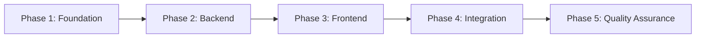
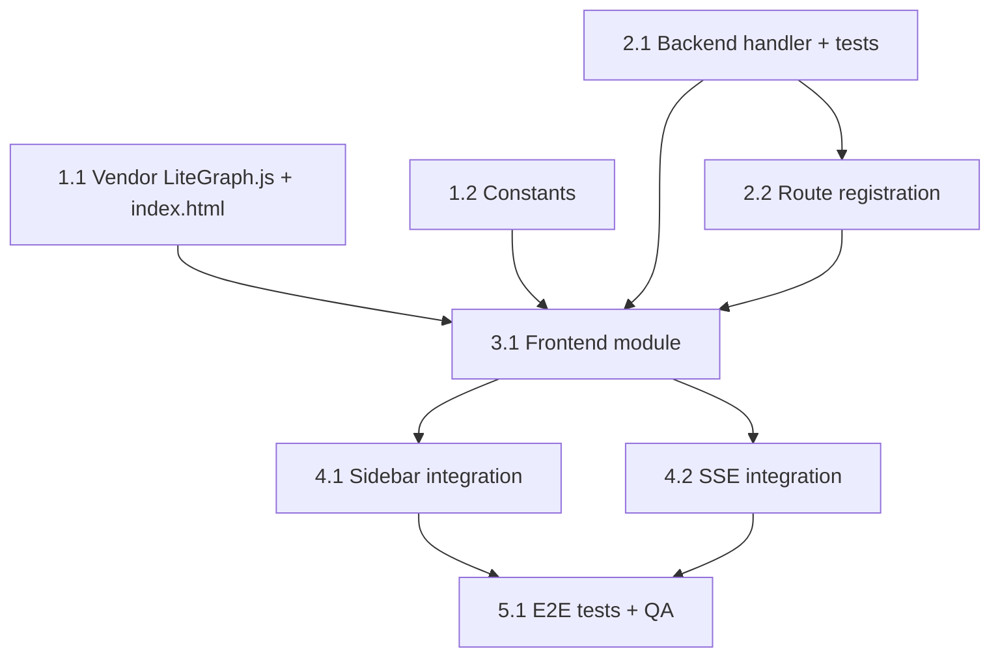

# Work Plan: System Overview

## Meta

```yaml
feature: system-overview
created: 2026-03-11
status: draft
strategy: vertical-slice (Strategy B -- Implementation-First)
design_doc: docs/plans/system-overview-design.md
prd: docs/plans/system-overview-prd.md
adr: docs/plans/system-overview-adr.md
estimated_commits: 8
test_files:
  backend: internal/api/handlers_overview_test.go (создается параллельно с реализацией)
  e2e: tests/tests/single/system-overview.spec.ts (выполняется в финальной фазе)
```

## Цель

Реализовать компонент "System Overview" -- диагностическую blueprint-диаграмму для визуализации межпроцессных связей в системе UniSet2. Позволяет инженерам видеть потоки данных между процессами одного сервера в реальном времени.

## Контекст

Сейчас каждый процесс (UObject) просматривается изолированно в своей вкладке. Нет способа увидеть связи между процессами на уровне системы. System Overview решает эту проблему, отображая процессы как узлы blueprint-диаграммы, связанные через общие датчики.

## Диаграмма фаз



## Диаграмма зависимостей задач



---

## Phase 1: Foundation (Vendor + Constants)

### Задача 1.1: Добавление LiteGraph.js vendor-файла и script-тега

- **Файлы**:
  - `ui/static/js/vendor/litegraph.js` (Create) -- vendor-копия LiteGraph.js v0.7.15
  - `ui/templates/index.html` (Modify) -- добавить `<script src="/static/js/vendor/litegraph.js">`
- **Зависимости**: Нет
- **Сложность**: Low
- **Критерии завершения**:
  - [x] Vendor-файл существует в `ui/static/js/vendor/litegraph.js`
  - [x] `<script>` тег добавлен в `index.html` перед `app.js`
  - [x] `make build` успешен
  - [x] В браузере `window.LiteGraph` доступен (L3: Build Success)
- **Верификация**: `make build`, проверить что `LiteGraph` доступен в console

### Задача 1.2: Добавление констант System Overview

- **Файлы**:
  - `ui/static/js/src/00-constants.js` (Modify) -- добавить константы Overview
- **Зависимости**: Нет
- **Сложность**: Low
- **Добавляемые константы**:
  ```javascript
  OVERVIEW_NODE_WIDTH, OVERVIEW_NODE_HORIZONTAL_SPACING,
  OVERVIEW_NODE_VERTICAL_SPACING, OVERVIEW_ACTIVE_COLOR,
  OVERVIEW_INACTIVE_COLOR, OVERVIEW_PULSE_DURATION_MS, OVERVIEW_FIT_PADDING
  ```
- **Критерии завершения**:
  - [x] Все 7 констант добавлены в `00-constants.js`
  - [x] `make app` успешен (L3: Build Success)
- **Верификация**: `make app`

---

## Phase 2: Backend (Handler + Route)

### Задача 2.1: Backend handler и unit-тесты

- **Файлы**:
  - `internal/api/handlers_overview.go` (Create) -- handler `GET /api/servers/{id}/overview`
  - `internal/api/handlers_overview_test.go` (Create) -- unit-тесты
- **Зависимости**: Нет (backend независим)
- **Сложность**: Medium
- **Реализация**:
  - Структуры: `OverviewPort`, `OverviewNode`, `OverviewEdge`, `OverviewResponse`
  - Метод `handleServerOverview(w, r)` в Handlers
  - Алгоритм: GetCachedObjects -> GetLastData -> build outputIndex -> compute edges
  - Side-effect: вызов `Watch()` для всех объектов сервера
  - Хелперы: `writeJSON`, `writeError` (по CLAUDE.md)
  - Ошибки: 503 если serverMgr==nil, 404 если сервер не найден
- **Unit-тесты** (tabular tests):
  - [x] Пустой сервер (0 объектов) -> пустой nodes/edges
  - [x] 2 объекта с совпадающими IO -> корректные edges
  - [x] Объект без IO -> узел с пустыми inputs/outputs
  - [x] Несуществующий serverID -> 404
  - [x] serverMgr == nil -> 503
  - [x] Объекты сервера недоступны (GetCachedObjects error) -> 503
  - [x] Watch() вызван для всех объектов сервера (side-effect)
- **Критерии завершения**:
  - [x] Handler реализован с использованием `writeJSON`/`writeError`
  - [x] Все unit-тесты проходят (`go test ./internal/api/...`)
  - [x] Контракт API соответствует Design Doc (OverviewResponse)
  - [x] Edge computation корректен (AC F1, F3)
- **Верификация**: `go test ./internal/api/... -run TestHandleServerOverview -v`

### Задача 2.2: Регистрация маршрута

- **Файлы**:
  - `internal/api/server.go` (Modify) -- добавить маршрут в `setupRoutes()`
- **Зависимости**: Задача 2.1
- **Сложность**: Low
- **Критерии завершения**:
  - [ ] Маршрут `GET /api/servers/{id}/overview` зарегистрирован
  - [ ] `go test ./internal/api/...` проходит
  - [ ] `make build` успешен
- **Верификация**: `make build`, `go test ./internal/api/...`

---

## Phase 3: Frontend (Основной JS-модуль)

### Задача 3.1: Frontend модуль System Overview

- **Файлы**:
  - `ui/static/js/src/58-system-overview.js` (Create) -- основной модуль
- **Зависимости**: Задачи 1.1, 1.2, 2.1, 2.2
- **Сложность**: High (основной объем работы)
- **Реализация**:
  - Функция `openSystemOverview(serverId, serverName)` -- создание/переключение вкладки
  - Custom node type `UniSetProcessNode` с `onDrawForeground` для значений на портах
  - Fetch `GET /api/servers/{id}/overview` -> build LiteGraph graph
  - Layout: топологическая сортировка (Kahn's algorithm) left-to-right
  - Fallback на алфавитный порядок при циклах
  - Кнопка "Fit to Screen"
  - Canvas с ResizeObserver для адаптации размера
  - Обработка ошибок: LiteGraph.js not loaded -> сообщение в tab
- **AC покрытие**:
  - [x] F2: Blueprint-диаграмма с темным фоном, сеткой, узлами
  - [x] F3: Ребра связей между совпадающими портами
  - [x] F4: Текущие значения на портах (из начальной загрузки)
  - [x] F5: Подсветка активных (ненулевые) vs неактивных (нулевые) связей
  - [x] F6: Pan/zoom + кнопка Fit to Screen
  - [x] F8: Scoping по серверу (один сервер на диаграмму)
- **Критерии завершения**:
  - [x] `openSystemOverview()` создает вкладку с canvas
  - [x] Узлы и ребра рендерятся на основе backend-данных
  - [x] Layout размещает узлы left-to-right по слоям
  - [x] Fit to Screen работает
  - [x] `make app` + `make build` успешны
- **Верификация**: `make app`, `make build`, ручная проверка через dev-сервер

---

## Phase 4: Integration (Sidebar + SSE)

### Задача 4.1: Sidebar интеграция

- **Файлы**:
  - `ui/static/js/src/55-sidebar-groups.js` (Modify) -- добавить case `'overview'` в `activateSidebarGroupItem()`
- **Зависимости**: Задача 3.1
- **Сложность**: Low
- **Реализация**:
  - Добавить `case 'overview':` -> вызов `openSystemOverview(serverId, serverName)`
  - Секция "System Overview" рендерится для каждого сервера в sidebar
- **AC покрытие**:
  - [ ] F7: Sidebar секция видна для каждого сервера
  - [ ] F7: Клик открывает вкладку с диаграммой
- **Критерии завершения**:
  - [ ] Sidebar показывает "System Overview" для каждого сервера
  - [ ] Клик открывает вкладку с диаграммой
  - [ ] Повторный клик переключает на существующую вкладку (не дублирует)
  - [ ] `make app` успешен
- **Верификация**: `make app`, клик в sidebar через dev-сервер

### Задача 4.2: SSE realtime-обновление

- **Файлы**:
  - `ui/static/js/src/58-system-overview.js` (Modify) -- добавить SSE callback
- **Зависимости**: Задача 3.1
- **Сложность**: Medium
- **Реализация**:
  - Подписка на SSE `object_data` события для serverID текущей overview-вкладки
  - Обновление `portValues` на узлах при получении events
  - Пересчет цветов ребер (active/inactive)
  - Pulse-анимация при изменении значения (OVERVIEW_PULSE_DURATION_MS)
  - Сравнение с `prevValues` для определения изменений
- **AC покрытие**:
  - [ ] F4: Значения обновляются при SSE `object_data` (задержка <= poll interval + 1s)
  - [ ] F5: Анимация пульсации 0.5-1s при изменении значения
  - [ ] F5: Активные ребра зеленые, неактивные серые
- **Критерии завершения**:
  - [ ] SSE обновления отражаются на canvas
  - [ ] Пульсация видна при изменении значения
  - [ ] Цвета ребер корректно переключаются (active/inactive)
  - [ ] `make app` успешен
- **Верификация**: `make app`, проверка через dev-сервер с живым UniSet2

---

## Phase 5: Quality Assurance

### Задача 5.1: E2E тесты и финальная проверка

- **Файлы**:
  - `tests/tests/single/system-overview.spec.ts` (Create) -- E2E тесты
- **Зависимости**: Задачи 4.1, 4.2
- **Сложность**: Medium
- **E2E тесты**:
  - [ ] Открытие вкладки System Overview из sidebar
  - [ ] Отображение узлов и связей на canvas
  - [ ] Кнопка Fit to Screen
  - [ ] Обновление значений через SSE (mock-server)
- **Проверки качества**:
  - [ ] `go test ./...` -- все backend тесты проходят
  - [ ] `make js-tests` -- все E2E тесты проходят
  - [ ] `make build` -- сборка успешна
  - [ ] Ручная проверка: диаграмма 20 процессов рендерится < 2s
  - [ ] Ручная проверка: SSE обновления работают в реальном времени
- **AC финальная верификация**:
  - [ ] F1: Backend endpoint возвращает корректный JSON (nodes + edges)
  - [ ] F2: Blueprint-диаграмма отображается
  - [ ] F3: Ребра между совпадающими портами
  - [ ] F4: Значения обновляются через SSE
  - [ ] F5: Активные/неактивные связи визуально различимы
  - [ ] F6: Pan/zoom/fit-to-screen работают
  - [ ] F7: Sidebar секция для каждого сервера
  - [ ] F8: Только объекты выбранного сервера
- **Критерии завершения**:
  - [ ] Все E2E тесты проходят
  - [ ] Все backend тесты проходят
  - [ ] Все AC (F1-F8) выполнены
  - [ ] Performance: backend < 500ms, рендеринг < 1s для 20 процессов

---

## Риски и митигация

| Риск | Влияние | Вероятность | Митигация | Обнаружение |
|------|---------|-------------|-----------|-------------|
| LiteGraph.js `onDrawForeground` недостаточен для значений на портах | High | Low | Spike-тест в задаче 3.1; fallback -- tooltip при наведении | Фаза 3, при реализации кастомного узла |
| Узлы с 20+ портами слишком высокие | Medium | Medium | Ограничить N первых портов + "..." индикатор | Фаза 3, визуальная проверка |
| Топологическая сортировка дает плохой layout для реальных систем | Medium | Medium | MVP -- простой layout, будущее -- dagre/elkjs (F9) | Фаза 3, проверка на реальных данных |
| Canvas resize при смене вкладок | Low | Medium | ResizeObserver + пересоздание LGraphCanvas | Фаза 4, E2E тесты |

## Сводная таблица файлов

| Файл | Действие | Фаза | Задача |
|------|----------|------|--------|
| `ui/static/js/vendor/litegraph.js` | Create | 1 | 1.1 |
| `ui/templates/index.html` | Modify | 1 | 1.1 |
| `ui/static/js/src/00-constants.js` | Modify | 1 | 1.2 |
| `internal/api/handlers_overview.go` | Create | 2 | 2.1 |
| `internal/api/handlers_overview_test.go` | Create | 2 | 2.1 |
| `internal/api/server.go` | Modify | 2 | 2.2 |
| `ui/static/js/src/58-system-overview.js` | Create | 3 | 3.1 |
| `ui/static/js/src/55-sidebar-groups.js` | Modify | 4 | 4.1 |
| `ui/static/js/src/58-system-overview.js` | Modify | 4 | 4.2 |
| `tests/tests/single/system-overview.spec.ts` | Create | 5 | 5.1 |

## Quality Checklist

- [x] Design Doc(s) consistency verification
- [x] Phase composition based on technical dependencies
- [x] All requirements (F1-F8) converted to tasks
- [x] Quality assurance exists in final phase (Phase 5)
- [x] E2E verification procedures placed at integration points
- [x] Vendor dependency added FIRST (Phase 1)
- [x] Backend independent from frontend (can be developed in parallel)

## Прогресс

| Фаза | Статус | Задачи |
|------|--------|--------|
| Phase 1: Foundation | [ ] Not started | 1.1 [ ], 1.2 [ ] |
| Phase 2: Backend | [ ] Not started | 2.1 [ ], 2.2 [ ] |
| Phase 3: Frontend | [ ] Not started | 3.1 [ ] |
| Phase 4: Integration | [ ] Not started | 4.1 [ ], 4.2 [ ] |
| Phase 5: QA | [ ] Not started | 5.1 [ ] |

## Критерии завершения

- [ ] Все фазы (1-5) выполнены
- [ ] Все backend тесты проходят (`go test ./...`)
- [ ] Все E2E тесты проходят (`make js-tests`)
- [ ] Сборка успешна (`make build`)
- [ ] AC F1-F8 из PRD выполнены и верифицированы
- [ ] Backend endpoint отвечает < 500ms для 20 процессов
- [ ] Рендеринг диаграммы < 1s для 20 процессов
