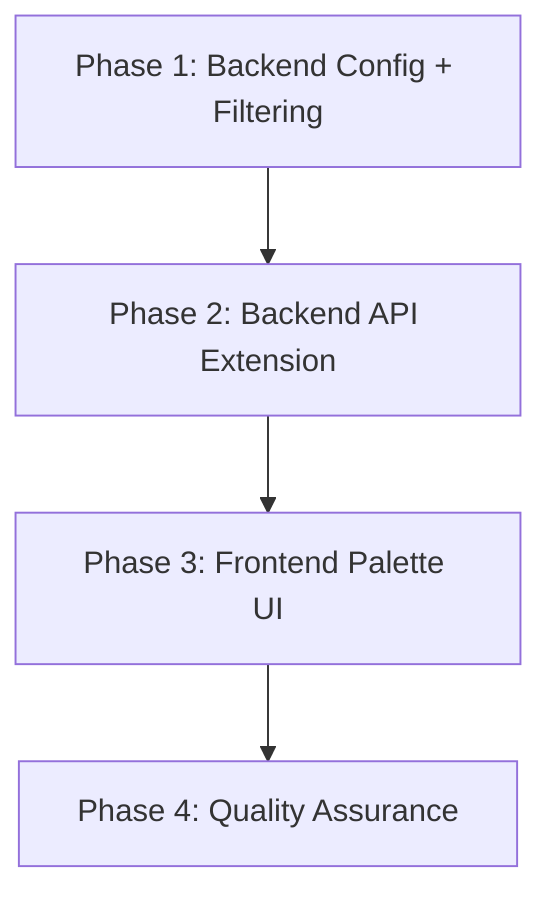
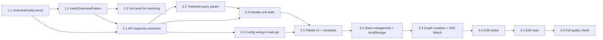

# Work Plan: Overview Object Palette Implementation

Created Date: 2026-03-13
Type: feature
Estimated Duration: 2 days
Estimated Impact: 9 files
Related Issue/PR: story/system-overview branch

## Related Documents
- Design Doc: [docs/plans/design-overview-palette.md]
- ADR: [docs/plans/system-overview-adr.md] (LiteGraph.js selection)

## Objective

Add an object palette dropdown to System Overview toolbar, allowing users to show/hide process nodes on the graph. Config provides default patterns, localStorage persists user selection, and SSE Watch is managed per visible set.

## Background

The System Overview currently shows all eligible process nodes unconditionally. In systems with many processes, the diagram becomes cluttered. The backend calls `Watch()` for all objects even if users only care about a subset. This feature adds config-level defaults and runtime user control.

## Risks and Countermeasures

### Technical Risks
- **Risk**: LiteGraph.js graph mutation (remove+re-add nodes) may cause visual glitches or lost link state
  - **Impact**: Medium -- graph may need full rebuild as fallback
  - **Countermeasure**: Use `graph.clear()` + full rebuild instead of incremental add/remove if glitches detected; keep rebuild logic as fallback path
  - **Detection**: Visual E2E test for node toggle

- **Risk**: Race condition between user palette toggle and incoming SSE object_data update
  - **Impact**: Low -- worst case is a brief flash of stale node
  - **Countermeasure**: SSE handler checks if node is in current selection before processing update

### Schedule Risks
- **Risk**: LiteGraph.js runtime behavior for dynamic node removal is not fully known
  - **Impact**: May need extra time for graph mutation approach
  - **Countermeasure**: Plan fallback (full rebuild on each toggle) from the start

## Phase Structure

## Task Dependencies

## Implementation Phases

### Phase 1: Backend Config + Filtering Logic (Estimated commits: 1)
**Purpose**: Define `OverviewConfig` struct and `matchOverviewPattern` helper with full unit test coverage.

**AC Coverage**: FR5 (config defaults), partial FR6 (filtering logic)

#### Tasks
- [ ] **1.1** Add `OverviewConfig` struct to `internal/config/yaml.go` with `Patterns` and `Exclude` fields (yaml tags: `patterns,omitempty` and `exclude,omitempty`)
- [ ] **1.2** Add `Overview *OverviewConfig` field to `ConfigFile` struct in `yaml.go`
- [ ] **1.3** Add `matchOverviewPattern(patterns, exclude []string, objectName string) bool` function in `handlers_overview.go`
  - Empty patterns = include all
  - Non-empty patterns: object must match at least one (via `path.Match`)
  - Exclude always takes precedence
  - Invalid patterns logged with `slog.Warn` and skipped
- [ ] **1.4** Add table-driven unit tests for `matchOverviewPattern` in `handlers_overview_test.go`:
  - Empty patterns (all included)
  - Single pattern match / no match
  - Multiple patterns
  - Exclude takes precedence over include
  - Invalid glob pattern (skipped)
  - Edge case: empty object name
- [ ] **1.5** Quality check: `go test ./internal/api/... ./internal/config/...` passes

#### Phase Completion Criteria
- [ ] `OverviewConfig` parses from YAML correctly
- [ ] `matchOverviewPattern` passes all table tests
- [ ] `go vet` and existing tests still pass

#### Operational Verification Procedures
1. Run `go test ./internal/api/ -run TestMatchOverviewPattern -v` -- all table tests pass
2. Run `go test ./internal/config/... -v` -- YAML parsing still works
3. Run `go vet ./...` -- no issues

---

### Phase 2: Backend API Response Extension (Estimated commits: 1)
**Purpose**: Extend `handleServerOverview` to return `allNodes`, support `?selected=` query param, and filter Watch calls.

**AC Coverage**: FR6 (API extension), FR7 (SSE Watch management), FR5 (config filtering applied)

#### Tasks
- [ ] **2.1** Add `AllNodes []OverviewNode` field to `OverviewResponse` struct (`json:"allNodes"`)
- [ ] **2.2** Add `overviewConfig *config.OverviewConfig` field to `Handlers` struct + `SetOverviewConfig(*config.OverviewConfig)` setter in `handlers.go`
- [ ] **2.3** Refactor `handleServerOverview`:
  - Collect all eligible objects into `allNodes` (sorted by name)
  - Check for `?selected=name1,name2,...` query parameter
  - If `?selected` present: `nodes` = only those names from eligible set, Watch called for them
  - If `?selected` absent and config set: filter via `matchOverviewPattern` for default `nodes`
  - If no config and no `?selected`: `nodes` = all eligible (backward compatible)
  - `edges` computed from `nodes` only
  - Watch called only for objects in `nodes`
  - `allNodes` always contains all eligible objects regardless of filtering
- [ ] **2.4** Add config wiring in `cmd/server/main.go`: `handlers.SetOverviewConfig(cfg.Overview)` (following `SetSidebarConfig` pattern)
- [ ] **2.5** Extend handler unit tests in `handlers_overview_test.go`:
  - Test: nil config returns all eligible in both `nodes` and `allNodes` (backward compat)
  - Test: config with patterns filters `nodes`, `allNodes` still has all
  - Test: config with exclude patterns
  - Test: `?selected=` query param overrides config filter
  - Test: `allNodes` is sorted alphabetically
  - Test: edges computed from `nodes` not `allNodes`
  - Test: Watch called only for `nodes` objects (verify via side-effect check)
- [ ] **2.6** Quality check: `go test ./internal/api/... -v` passes, `go vet ./...` clean

#### Phase Completion Criteria
- [ ] API returns `allNodes` field with all eligible objects
- [ ] `nodes` filtered by config or `?selected=`
- [ ] Backward compatible: nil config = all objects in `nodes`
- [ ] All existing + new tests pass

#### Operational Verification Procedures
1. Run `go test ./internal/api/ -run TestHandleServerOverview -v` -- all tests pass including new ones
2. Start dev server (`docker compose up dev-viewer -d --build`), call `curl http://localhost:8000/api/servers/{id}/overview | jq '.allNodes | length'` -- returns count of all eligible objects
3. Call with `?selected=ProcessA` -- verify `nodes` contains only ProcessA
4. Run `go vet ./...` -- no issues

---

### Phase 3: Frontend Palette UI + State Management (Estimated commits: 2)
**Purpose**: Implement palette dropdown, localStorage persistence, graph mutation, and SSE Watch integration.

**AC Coverage**: FR1 (toolbar palette), FR2 (bulk actions), FR3 (object toggle), FR4 (state persistence), FR7 (Watch lifecycle)

#### Tasks
- [ ] **3.1** Add constants to `00-constants.js`:
  - `OVERVIEW_PALETTE_LS_PREFIX = 'overview-palette:'` (localStorage key prefix)
  - Any other palette-related constants (dropdown dimensions, etc.)
- [ ] **3.2** Add palette dropdown UI in `58-system-overview.js`:
  - "Objects" button in toolbar (next to Fit/Layout buttons)
  - Dropdown panel with checkbox per object (from `allNodes`)
  - "Add All" / "Remove All" / "Reset" buttons
  - Click outside closes dropdown
  - Click button toggles dropdown open/close
- [ ] **3.3** Implement state management in `58-system-overview.js`:
  - Store current selection as `Set` of object names in `overviewInstances[serverId]`
  - On tab open: check localStorage `overview-palette:${tabKey}` first, then fall back to `data.nodes` names
  - On selection change: persist to localStorage
  - "Reset" clears localStorage and uses `data.nodes` from API response as defaults
- [ ] **3.4** Implement graph mutation logic:
  - On object check: add LiteGraph node + recompute edges from `allNodes` data, call `fetchOverviewData` with `?selected=` to trigger Watch
  - On object uncheck: remove LiteGraph node + associated links from graph (no Unwatch call)
  - SSE `object_data` handler: skip updates for objects not in current selection
  - Fallback: if incremental mutation causes glitches, use full graph rebuild
- [ ] **3.5** Add CSS styles to `style.css`:
  - `.overview-palette-btn` for the Objects button
  - `.overview-palette-dropdown` for the dropdown panel
  - `.overview-palette-item` for each checkbox row
  - `.overview-palette-actions` for bulk action buttons
  - Dropdown positioning (absolute, below toolbar)
  - Scrollable list for many objects
- [ ] **3.6** Run `make app` to rebuild `app.js`
- [ ] **3.7** Quality check: `make build` succeeds, visual check via dev server

#### Phase Completion Criteria
- [ ] Palette button visible in toolbar
- [ ] Dropdown shows all eligible objects with checkboxes
- [ ] Toggle adds/removes nodes from graph
- [ ] Bulk actions (Add All, Remove All, Reset) work
- [ ] Selection persists in localStorage across page reloads
- [ ] `make build` succeeds

#### Operational Verification Procedures
1. Start dev server: `docker compose up dev-viewer -d --build`
2. Open http://localhost:8000, navigate to System Overview
3. Verify "Objects" button appears in toolbar
4. Click "Objects" -- dropdown with checkboxes appears
5. Uncheck an object -- node disappears from graph
6. Check it back -- node reappears with edges
7. Click "Remove All" -- graph empty
8. Click "Add All" -- all nodes appear
9. Click "Reset" -- defaults restored
10. Reload page -- selection persists from localStorage
11. Click outside dropdown -- dropdown closes

---

### Phase 4: Quality Assurance (Estimated commits: 1)
**Purpose**: E2E tests, full regression, acceptance criteria verification.

#### Tasks
- [ ] **4.1** Extend E2E tests in `tests/single/system-overview.spec.ts`:
  - Test: palette button visible in toolbar
  - Test: click palette button shows dropdown with checkboxes
  - Test: uncheck object removes it from graph (canvas node count decreases)
  - Test: check object adds it back
  - Test: "Remove All" empties graph
  - Test: "Add All" restores all nodes
  - Test: "Reset" restores defaults
  - Test: reload page preserves selection
- [ ] **4.2** Run full backend tests: `go test ./...`
- [ ] **4.3** Run full E2E tests: `make js-tests`
- [ ] **4.4** Verify all Design Doc acceptance criteria (FR1-FR7) are met
- [ ] **4.5** Verify `make build` succeeds clean

#### Phase Completion Criteria
- [ ] All acceptance criteria (FR1-FR7) verified
- [ ] `go test ./...` passes
- [ ] `make js-tests` passes (all E2E including new palette tests)
- [ ] `make build` succeeds
- [ ] No regressions in existing System Overview tests

#### Operational Verification Procedures
1. Run `go test ./... -v` -- all pass
2. Stop dev-viewer: `docker compose --profile dev down`
3. Run `make js-tests` -- all E2E tests pass
4. Review AC checklist against Design Doc FR1-FR7

## Quality Checklist

- [ ] Design Doc consistency verification (all FR1-FR7 covered)
- [ ] Phase composition based on technical dependencies (config -> API -> frontend)
- [ ] All requirements converted to tasks
- [ ] Quality assurance exists in final phase
- [ ] E2E verification procedures placed at integration points
- [ ] Handler helpers used (`writeJSON`, `writeError`)
- [ ] Config follows `*Config` pattern in `yaml.go` with setter in `handlers.go`
- [ ] Constants in `00-constants.js` with `UPPER_CASE` naming
- [ ] `make app` run after JS changes
- [ ] E2E tests in `tests/single/`

## Completion Criteria
- [ ] All phases completed
- [ ] Each phase's operational verification procedures executed
- [ ] Design Doc acceptance criteria (FR1-FR7) satisfied
- [ ] All tests pass (`go test ./...` + `make js-tests`)
- [ ] `make build` succeeds
- [ ] User review approval obtained

## Progress Tracking

### Phase 1
- Start:
- Complete:
- Notes:

### Phase 2
- Start:
- Complete:
- Notes:

### Phase 3
- Start:
- Complete:
- Notes:

### Phase 4
- Start:
- Complete:
- Notes:

## Notes
- Implementation follows Strategy B (implementation-first) since no test skeleton files were provided
- `matchOverviewPattern` uses `path.Match` from stdlib (same as sidebar resolver, but without entity type prefix)
- Watch is additive-only: removing a node does NOT call Unwatch. Watch state resets on tab close/SSE reconnect
- localStorage key uses `tabKey` format: `overview-palette:${tabKey}` for multi-server support
- `allNodes` in API response contains full `OverviewNode` objects (not just names) so frontend can add nodes without extra API calls
